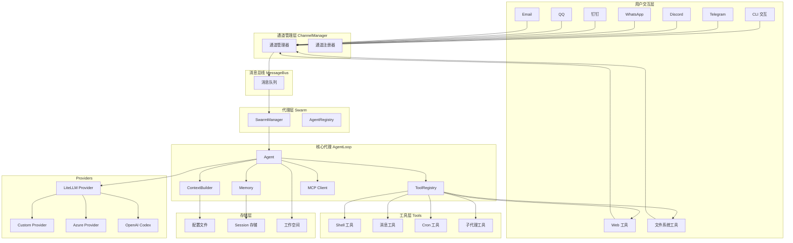
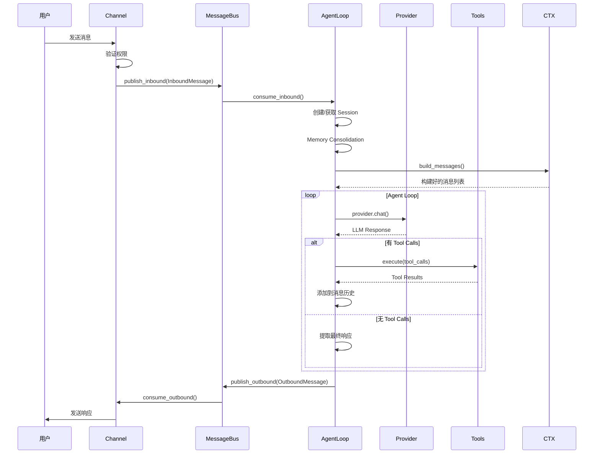
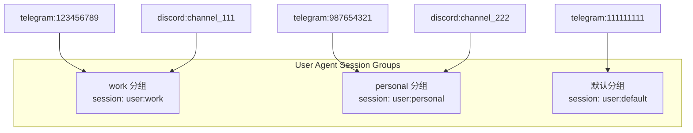
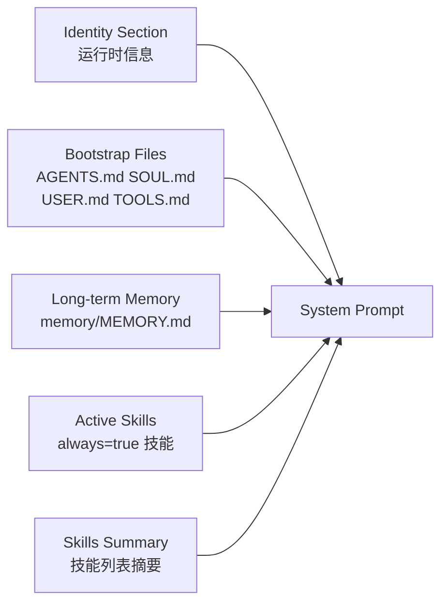
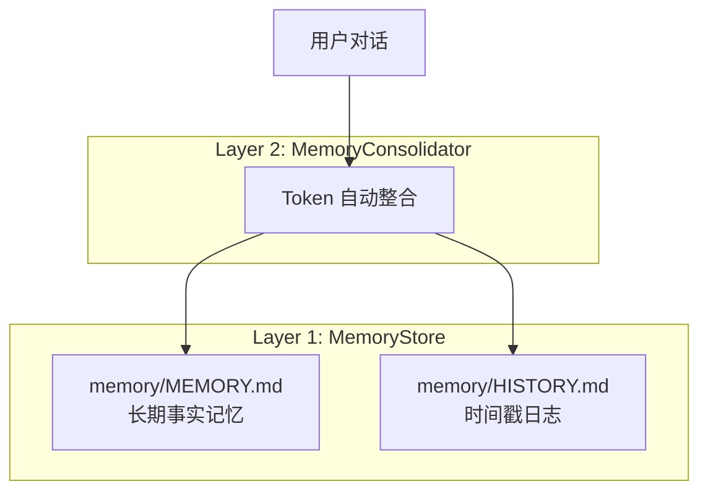
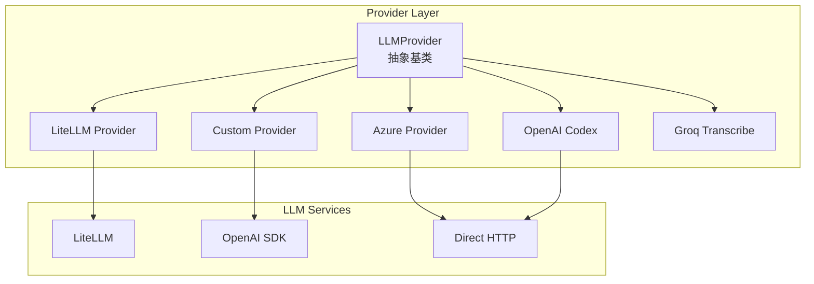
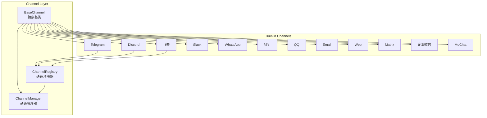
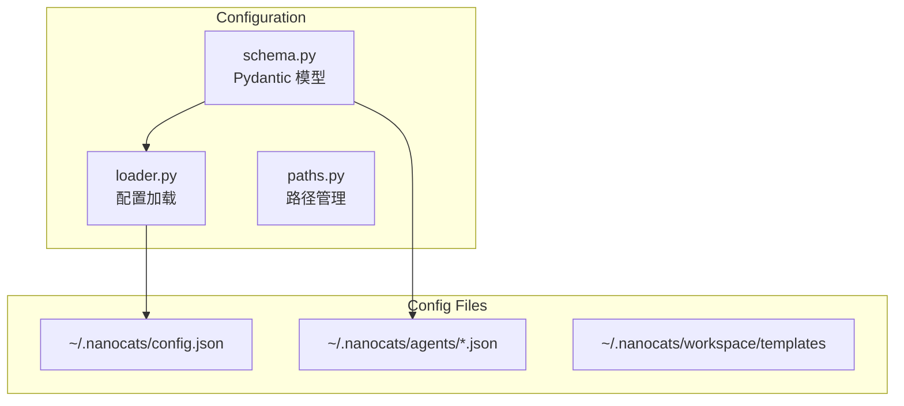
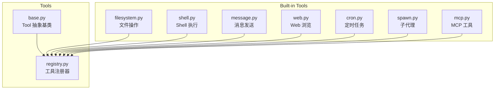
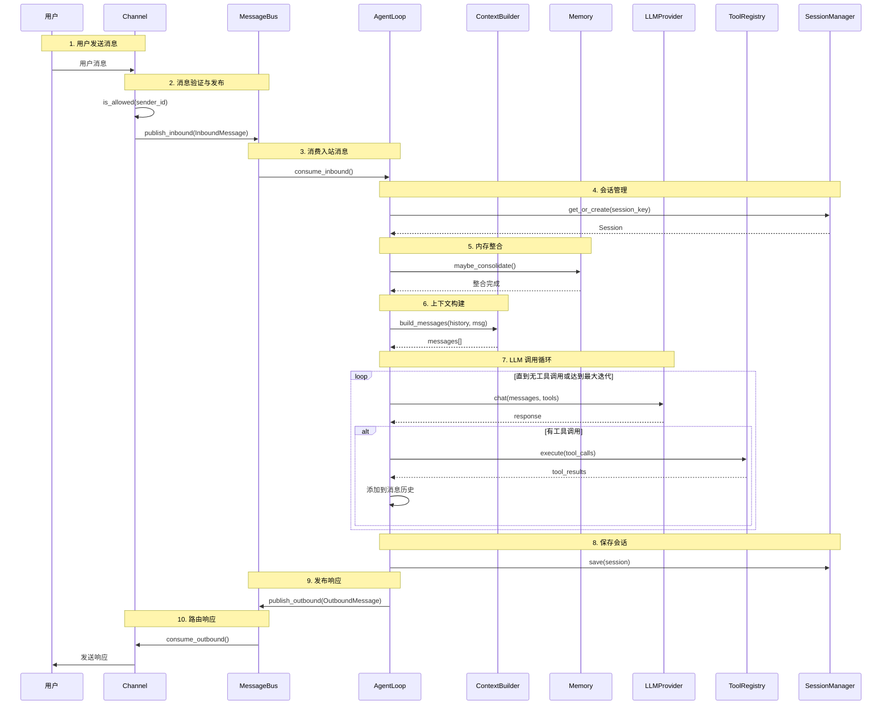

# nanocats 架构设计文档

> 基于源码分析的全量架构文档
> 版本: 0.1.6
> 生成日期: 2026-03-15

---

## 目录

1. [项目概览](#1-项目概览)
2. [系统架构图](#2-系统架构图)
3. [核心模块详解](#3-核心模块详解)
   - 3.1 [Agent 模块](#31-agent-模块)
   - 3.2 [Swarm 模块](#32-swarm-模块)
   - 3.3 [Provider 模块](#33-provider-模块)
   - 3.4 [Channel 模块](#34-channel-模块)
   - 3.5 [Message Bus 模块](#35-message-bus-模块)
   - 3.6 [Config 模块](#36-config-模块)
   - 3.7 [Session 模块](#37-session-模块)
   - 3.8 [Tools 模块](#38-tools-模块)
   - 3.9 [Skills 模块](#39-skills-模块)
   - 3.10 [Cron 模块](#310-cron-模块)
   - 3.11 [Heartbeat 模块](#311-heartbeat-模块)
4. [数据流与消息处理](#4-数据流与消息处理)
5. [配置体系](#5-配置体系)
6. [扩展开发指南](#6-扩展开发指南)

---

## 1. 项目概览

### 1.1 项目定位

nanocats 是一个超轻量级的个人 AI 助手框架，基于 [nanobot](https://github.com/HKUDS/nanobot) 构建，扩展了 Agent Swarm 能力和多代理编排功能。

### 1.2 核心特性

| 特性 | 描述 |
|------|------|
| **超轻量级** | 极简代码，快速启动，低资源占用 |
| **多通道支持** | 支持 Telegram、Discord、飞书、Slack、WhatsApp、钉钉、QQ、邮件、WebSocket |
| **多代理系统** | 支持 ADMIN、USER、SPECIALIZED、TASK 四种代理类型 |
| **会话分组** | User 类型代理支持会话分组，跨通道共享对话上下文 |
| **灵活工具** | 内置文件操作、Shell 执行、网页搜索、MCP 集成等工具 |
| **记忆系统** | 持久化记忆，支持自动整合 |
| **技能系统** | 可扩展的技能系统 |
| **定时任务** | 基于 Cron 的任务调度 |

### 1.3 技术栈

- **语言**: Python ≥ 3.11
- **CLI 框架**: Typer + Prompt Toolkit
- **LLM 集成**: LiteLLM + 直接 SDK 调用
- **Web 框架**: FastAPI (Web 后端) + React (前端)
- **消息队列**: 异步消息总线 (asyncio)

---

## 2. 系统架构图

### 2.1 整体架构



### 2.2 消息流向图



### 2.3 代理类型与会话

#### 2.3.1 AgentType 枚举

**实际代码中的 AgentType** (`config/schema.py`):

```python
class AgentType(str, Enum):
    ADMIN = "admin"       # 全局会话 (session: "global")
    USER = "user"         # 用户级会话 (session: "user:{group_id}")
    SPECIALIZED = "specialized"  # 代理级会话 (session: "agent:{agent_id}")
    TASK = "task"         # 任务级会话 (session: "task:{agent_id}")
```

#### 2.3.2 会话策略映射

| Agent Type | Session Key | 说明 |
|------------|------------|------|
| ADMIN | `global` | 全局会话，单实例 |
| USER | `user:{group_id}` | 按用户会话，支持分组 |
| SPECIALIZED | `agent:{agent_id}` | 按代理会话 |
| TASK | `task:{agent_id}` | 按任务会话 |

#### 2.3.3 User 代理会话分组

对于 USER 类型的代理，可以通过 `session_groups` 配置将多个不同通道的聊天 ID 组合到同一会话分组，实现跨通道共享对话上下文。

**配置结构** (`config/schema.py`):

```python
class SessionGroup(BaseModel):
    group_id: str           # 分组标识
    chat_ids: dict[str, str]  # 通道 -> 聊天ID 映射

class AgentChannelsConfig(BaseModel):
    configs: dict[str, ChannelConfig]
    session_groups: list[SessionGroup]  # 会话分组列表
    allow_agents: list[str]
```

**配置示例**:

```json
{
  "id": "myagent",
  "name": "My Agent",
  "type": "user",
  "channels": {
    "session_groups": [
      {
        "group_id": "work",
        "chat_ids": {
          "telegram": "123456789",
          "discord": "channel_111"
        }
      },
      {
        "group_id": "personal",
        "chat_ids": {
          "telegram": "987654321",
          "discord": "channel_222"
        }
      }
    ]
  }
}
```

**解析逻辑** (`agent/registry.py`):

```python
def find_by_channel(self, channel: str, chat_id: str) -> tuple[AgentConfig, group_id] | None:
    # 1. 检查通道是否启用
    # 2. 验证 chat_id 在 allow_from 列表
    # 3. 查找会话分组
    group_id = self._find_session_group(agent, channel, chat_id)
    return agent, group_id

def _find_session_group(self, agent: AgentConfig, channel: str, chat_id: str) -> str | None:
    for sg in agent.channels.session_groups:
        if channel in sg.chat_ids and sg.chat_ids[channel] == chat_id:
            return sg.group_id
    return None
```

**工作原理**:
- 消息进入时，根据 `channel` 和 `chat_id` 查找所属的会话分组
- 如果找到分组，session key 为 `user:{group_id}`
- 同一分组内的不同通道消息共享同一会话历史
- 未配置分组的 USER 类型代理使用默认分组 `user:default`



---

## 3. 核心模块详解

### 3.1 Agent 模块

**位置**: `nanocats/agent/`

Agent 模块是 nanocats 的核心，负责处理用户消息、执行 LLM 调用、管理工具和记忆。

#### 3.1.1 AgentLoop (`agent/loop.py`)

**核心职责**:
- 异步消息处理主循环
- LLM 调用与工具执行迭代
- 会话管理
- 子代理管理
- MCP 连接管理

**主要流程**:

```python
class AgentLoop:
    async def run(self) -> None:
        """主循环：持续消费入站消息"""
        while self._running:
            msg = await self.bus.consume_inbound()
            await self._dispatch(msg)

    async def _process_message(self, msg) -> str:
        # 1. 获取/创建会话
        session = self.sessions.get_or_create(msg.session_key)
        
        # 2. 内存整合
        self.memory_consolidator.maybe_consolidate_by_tokens(session)
        
        # 3. 构建上下文
        messages = self.context.build_messages(
            session.get_history(),
            msg.content,
            msg.media
        )
        
        # 4. 执行代理循环
        response = await self._run_agent_loop(messages)
        
        # 5. 保存会话
        self.sessions.save(session)
        
        return response

    async def _run_agent_loop(self, messages) -> str:
        """LLM + Tools 迭代循环"""
        while iteration < self.max_iterations:
            # 调用 LLM
            response = await self.provider.chat_with_retry(messages)
            
            # 有工具调用则执行
            if response.tool_calls:
                for tool_call in response.tool_calls:
                    result = await self.tools.execute(
                        tool_call.name,
                        tool_call.arguments
                    )
                    messages.append({
                        "role": "assistant",
                        "tool_call_id": tool_call.id,
                        "content": result
                    })
            else:
                # 无工具调用，返回响应
                return response.content
        
        return "达到最大迭代次数"
```

**关键特性**:
- **进度回调**: 支持 `on_progress` 回调实时输出流式进度
- **命令处理**: 支持 `/new`, `/stop`, `/restart`, `/help` 等命令
- **错误处理**: 优雅降级，返回错误信息而非崩溃
- **直接处理**: 支持 `process_direct()` 用于 CLI/Cron 场景

#### 3.1.2 ContextBuilder (`agent/context.py`)

**职责**: 构建 LLM 调用的完整上下文

**系统提示组成**:



**代码实现**:

```python
def build_system_prompt(self) -> str:
    sections = []
    
    # 1. Identity Section
    sections.append(self._get_identity())
    
    # 2. Bootstrap Files
    bootstrap = self._load_bootstrap_files()
    if bootstrap:
        sections.append(bootstrap)
    
    # 3. Long-term Memory
    memory_ctx = self.memory_store.get_memory_context()
    if memory_ctx:
        sections.append(f"## Long-term Memory\n{memory_ctx}")
    
    # 4. Active Skills
    for skill in self.skills_loader.get_always_active():
        sections.append(f"\n\n---\n\n{skill.content}")
    
    # 5. Skills Summary
    skills_summary = self.skills_loader.build_skills_summary()
    sections.append(f"\n\n## Available Skills\n{skills_summary}")
    
    return "\n\n".join(sections)
```

**运行时上下文**:
```python
def _build_runtime_context(self, channel: str, chat_id: str) -> str:
    return f"""[Runtime Context — metadata only, not instructions]
Current Time: {datetime.now().isoformat()}
Channel: {channel}
Chat ID: {chat_id}
"""
```

#### 3.1.3 Memory System (`agent/memory.py`)

**两层记忆架构**:



**MemoryStore** - 长期记忆管理:
- **MEMORY.md**: 长期事实记忆 (用户偏好、关键事实、项目信息)
- **HISTORY.md**: 时间序日志，可 grep 搜索

**整合流程**:
```python
async def maybe_consolidate_by_tokens(self, session: Session) -> None:
    # 1. 估算当前 prompt 大小
    estimated = self.estimate_session_prompt_tokens(session)
    
    # 2. 超过上下文窗口一半时触发整合
    if estimated > self.context_window_tokens / 2:
        boundary = self.pick_consolidation_boundary(session)
        
        # 3. 调用 LLM 生成摘要
        summary = await self._consolidate_with_llm(session, boundary)
        
        # 4. 更新记忆文件
        self.memory_store.append_history(summary.history_entry)
        if summary.memory_update:
            self.memory_store.update_memory(summary.memory_update)
```

#### 3.1.4 Agent Registry (`agent/registry.py`)

**代理配置管理**:
```python
class AgentRegistry:
    def find_by_channel(channel: str, chat_id: str) -> tuple[AgentConfig, group_id] | None:
        """根据通道和聊天ID查找代理"""
        # 1. 遍历所有代理
        # 2. 检查通道是否启用
        # 3. 验证 chat_id 在 allow_from 列表
        # 4. 查找会话分组
        # 5. 返回代理配置和分组ID
        group_id = self._find_session_group(agent, channel, chat_id)
        return agent, group_id
    
    def _find_session_group(agent: AgentConfig, channel: str, chat_id: str) -> str | None:
        """查找消息所属的会话分组"""
        for sg in agent.channels.session_groups:
            if channel in sg.chat_ids and sg.chat_ids[channel] == chat_id:
                return sg.group_id
        return None
    
    def resolve_session_key(agent: AgentConfig, group_id: str | None = None) -> str:
        """根据代理类型解析会话键"""
        if agent.type == AgentType.ADMIN:
            return "global"
        elif agent.type == AgentType.USER:
            return f"user:{group_id or 'default'}"
        elif agent.type == AgentType.SPECIALIZED:
            return f"agent:{agent.id}"
        elif agent.type == AgentType.TASK:
            return f"task:{agent.id}"
```

---

### 3.2 Swarm 模块

**位置**: `nanocats/swarm/`

Swarm 模块负责多代理的编排和管理。

#### 3.2.1 SwarmManager (`swarm/manager.py`)

**核心组件**:
```python
class SwarmManager:
    bus: MessageBus              # 异步消息队列
    provider: LLMProvider        # LLM 提供者
    registry: AgentRegistry      # 代理配置存储
    agents: dict[str, AgentLoop] # 运行中的代理实例
```

**启动流程**:
```python
async def start(self) -> None:
    """启动所有自动启动的代理"""
    auto_start_agents = self.registry.get_auto_start_agents()
    for config in auto_start_agents:
        await self.start_agent(config)

async def start_agent(self, config: AgentConfig) -> None:
    """创建并启动单个代理"""
    agent = AgentLoop(
        bus=self.bus,
        agent_config=config,
        provider=self.provider
    )
    self.agents[config.id] = agent
    asyncio.create_task(agent.run())  # 非阻塞启动
```

#### 3.2.2 子代理系统 (`agent/subagent.py`)

**子代理管理器**:
```python
class SubagentManager:
    def spawn(self, session_key: str, task: str) -> str:
        """后台启动子代理，返回任务ID"""
        task_id = generate_task_id()
        
        # 创建后台任务
        asyncio.create_task(self._run_subagent(task_id, session_key, task))
        
        return f"Task {task_id} started in background"
    
    async def _run_subagent(self, task_id: str, session_key: str, task: str):
        """子代理执行"""
        # 1. 构建受限工具集 (无 spawn, 无 message)
        # 2. 创建专注的系统提示
        # 3. 运行代理循环 (最多15次迭代)
        # 4. 通过消息总线公告结果
```

**子代理特性**:
- 使用受限工具集 (防止递归 spawn)
- 最多 15 次迭代
- 结果注入主代理会话触发总结

---

### 3.3 Provider 模块

**位置**: `nanocats/providers/`

Provider 模块封装了各种 LLM API 的调用。

#### 3.3.1 Provider 架构



#### 3.3.2 Provider 分类

| 类型 | Provider | 说明 |
|------|----------|------|
| 直连 | custom | 任何 OpenAI 兼容端点 |
| 直连 | azure_openai | Azure OpenAI API |
| 网关 | openrouter | 路由任意模型 |
| 网关 | aihubmix | AiHubMix API 网关 |
| 网关 | siliconflow | 硅基流动 |
| 网关 | volcengine | 火山引擎 |
| 网关 | volcengine_coding_plan | 火山引擎 Coding Plan |
| 网关 | byteplus | BytePlus (火山引擎国际版) |
| 网关 | byteplus_coding_plan | BytePlus Coding Plan |
| 标准 | anthropic | Claude 模型 |
| 标准 | openai | GPT 模型 |
| 标准 | deepseek | DeepSeek 模型 |
| 标准 | gemini | Google Gemini 模型 |
| 标准 | groq | Groq 模型 |
| 标准 | zhipu | 智谱 AI |
| 标准 | dashscope | 阿里云 DashScope |
| 标准 | moonshot | Moonshot AI |
| 标准 | minimax | MiniMax 模型 |
| 本地 | vllm | vLLM 本地部署 |
| 本地 | ollama | Ollama 本地模型 |
| OAuth | openai_codex | OpenAI Codex |
| OAuth | github_copilot | GitHub Copilot |

#### 3.3.3 LLMProvider 基类 (`providers/base.py`)

```python
class LLMProvider(ABC):
    @dataclass
    class LLMResponse:
        content: str
        tool_calls: list[ToolCallRequest] | None
        finish_reason: str | None
        usage: dict
        reasoning_content: str | None
    
    @abstractmethod
    async def chat(
        self,
        messages: list[dict],
        tools: list[dict] | None = None,
        model: str | None = None,
        **kwargs
    ) -> LLMResponse:
        """发送聊天完成请求"""
        pass

    async def chat_with_retry(self, messages, tools, **kwargs) -> LLMResponse:
        """指数退避重试 (1s, 2s, 4s)"""
        # 429, rate limit, 5xx, connection errors
```

#### 3.3.4 Provider 注册 (`providers/registry.py`)

```python
@dataclass
class ProviderSpec:
    name: str                    # 配置字段名
    keywords: tuple[str]          # 模型名关键词
    env_key: str                 # LiteLLM 环境变量
    display_name: str            # 显示名称
    is_gateway: bool             # 是否网关
    is_local: bool               # 是否本地部署
    is_oauth: bool               # 是否 OAuth
    recommended_models: tuple     # 推荐模型列表
    # ... 其他元数据
```

#### 3.3.5 Provider 选择逻辑

```python
def _match_provider(self, model: str) -> tuple[ProviderConfig, str]:
    # 1. 强制 provider
    if agents.defaults.provider != "auto":
        return get_provider(agents.defaults.provider)
    
    # 2. 显式前缀: model = "deepseek/v3"
    if "/" in model:
        prefix = model.split("/")[0]
        if match_provider_prefix(prefix):
            return match
    
    # 3. 关键词匹配
    for spec in PROVIDERS:
        if any(keyword in model for keyword in spec.keywords):
            return match
    
    # 4. 本地回退: 按 api_base 关键词
    # 5. 网关回退
    # 6. 通用回退
```

---

### 3.4 Channel 模块

**位置**: `nanocats/channels/`

Channel 模块处理与各种聊天平台的集成。

#### 3.4.1 Channel 架构



#### 3.4.2 BaseChannel (`channels/base.py`)

```python
class BaseChannel(ABC):
    name: str
    display_name: str
    
    @abstractmethod
    async def start(self) -> None:
        """启动通道连接"""
        pass
    
    @abstractmethod
    async def stop(self) -> None:
        """停止通道连接"""
        pass
    
    @abstractmethod
    async def send(self, msg: OutboundMessage) -> None:
        """发送出站消息"""
        pass
    
    def is_allowed(self, sender_id: str) -> bool:
        """验证发送者权限"""
        return sender_id in self.config.allow_from or "*" in self.config.allow_from
    
    def _handle_message(self, msg: InboundMessage) -> None:
        """处理接收到的消息并发布到总线"""
        self.bus.publish_inbound(msg)
```

#### 3.4.3 Channel 实现模式

**WebChannel** (WebSocket):
```python
class WebChannel(BaseChannel):
    name = "web"
    display_name = "Web UI"  # 仅为 WebSocket 聊天，非完整管理界面
```

**Telegram** (长轮询):
```python
async def start(self) -> None:
    application = ApplicationBuilder().token(self.token).build()
    application.add_handler(MessageHandler(self._handle_update))
    await application.run_polling()
```

**Discord** (Gateway WebSocket):
```python
async def start(self) -> None:
    intents = Intents.default()
    intents.message_content = True
    client = Client(intents=intents)
    client.event(self._on_message)
    await client.start(self.token)
```

**飞书** (WebSocket 长连接):
```python
async def start(self) -> None:
    client = Lark(self.app_id, self.app_secret)
    await client.start_websocket(self._on_message)
```

#### 3.4.4 ChannelManager (`channels/manager.py`)

ChannelManager 负责初始化和管理所有通道。它从两个来源合并配置：

1. **主配置** (`~/.nanocats/config.json`) - 简化格式: `channels.web.enabled: true`
   - 仅用于决定 gateway 启动时启用哪些通道
2. **Agent 配置** (`~/.nanocats/agents/{id}.json`) - 详细格式: `channels.configs.web.allowFrom: [...]`
   - 用于消息路由时的权限验证

```python
class ChannelManager:
    def __init__(self, config, bus, agent_registry):
        self.channels = {}  # name -> Channel instance
        
        # 1. 从主配置获取启用的通道
        for name, cls in discover_all().items():
            section = getattr(config.channels, name, None)
            if section and section.enabled:
                self.channels[name] = cls(config, bus, agent_registry)
        
        # 2. 从 Agent 配置补充 allow_from
        if agent_registry:
            for agent in agent_registry.get_all().values():
                for ch_name, ch_config in agent.channels.configs.items():
                    if ch_config.enabled and ch_name in self.channels:
                        channel = self.channels[ch_name]
                        channel.config.allow_from = ch_config.allow_from
    
    async def start_all(self) -> None:
        for channel in self.channels.values():
            await channel.start()
    
    async def _dispatch_outbound(self) -> None:
        """消费出站消息并路由"""
        while True:
            msg = await self.bus.consume_outbound()
            channel = self.channels.get(msg.channel)
            if channel:
                await channel.send(msg)
```

**配置优先级**:
- 通道启用状态: 主配置 (`channels.{name}.enabled`)
- 权限控制: Agent 配置 (`channels.configs.{name}.allowFrom`)

---

### 3.5 Message Bus 模块

**位置**: `nanocats/bus/`

Message Bus 提供异步消息队列，解耦各组件。

#### 3.5.1 消息类型 (`bus/events.py`)

```python
@dataclass
class InboundMessage:
    channel: str           # 通道名 (telegram, discord, etc.)
    sender_id: str        # 发送者ID
    chat_id: str          # 会话ID
    content: str          # 消息内容
    media: list[str]      # 媒体文件路径
    metadata: dict        # 平台特定元数据
    session_key: str      # 计算: channel:chat_id
    agent_id: str         # 解析的代理ID
    agent_type: str       # 解析的代理类型

@dataclass
class OutboundMessage:
    channel: str           # 目标通道
    chat_id: str          # 目标会话
    content: str          # 响应内容
    reply_to: str         # 回复的消息ID
    media: list[str]      # 发送的文件
    metadata: dict        # 平台特定选项
```

#### 3.5.2 消息队列 (`bus/queue.py`)

```python
class MessageBus:
    def __init__(self):
        self._inbound: asyncio.Queue = asyncio.Queue()
        self._outbound: asyncio.Queue = asyncio.Queue()
    
    async def publish_inbound(self, msg: InboundMessage) -> None:
        await self._inbound.put(msg)
    
    async def consume_inbound(self) -> InboundMessage:
        return await self._inbound.get()
    
    async def publish_outbound(self, msg: OutboundMessage) -> None:
        await self._outbound.put(msg)
    
    async def consume_outbound(self) -> OutboundMessage:
        return await self._outbound.get()
```

---

### 3.6 Config 模块

**位置**: `nanocats/config/`

Config 模块管理整个系统的配置。

#### 3.6.1 配置架构



#### 3.6.2 Config Schema (`config/schema.py`)

```python
class Config(BaseSettings):
    agents: AgentsConfig
    channels: ChannelsConfig
    providers: ProvidersConfig
    gateway: GatewayConfig
    tools: ToolsConfig

class AgentsConfig(Base):
    defaults: AgentDefaults
    swarm: SwarmConfig | None

class AgentDefaults(Base):
    workspace: str
    model: str
    provider: str  # "auto" for auto-detection
    max_tokens: int
    context_window_tokens: int
    temperature: float
    max_tool_iterations: int

class ProvidersConfig(Base):
    # 20+ provider configs
    custom: ProviderConfig
    openrouter: ProviderConfig
    anthropic: ProviderConfig
    openai: ProviderConfig
    deepseek: ProviderConfig
    # ... more

class ToolsConfig(Base):
    web: WebToolsConfig
    exec: ExecToolConfig
    restrict_to_workspace: bool
    mcp_servers: dict[str, MCPServerConfig]
```

#### 3.6.3 配置加载 (`config/loader.py`)

```python
def load_config(config_path: Path | None = None) -> Config:
    path = config_path or get_config_path()
    if not path.exists():
        return Config()  # 返回默认配置
    
    with open(path) as f:
        data = json.load(f)
    
    return Config(**data)
```

#### 3.6.4 路径管理 (`config/paths.py`)

```python
def get_config_path() -> Path:
    return Path.home() / ".nanocats" / "config.json"

def get_workspace_path() -> Path:
    return Path.home() / ".nanocats" / "workspace"

def get_agents_dir() -> Path:
    return Path.home() / ".nanocats" / "agents"

def get_cron_dir() -> Path:
    return Path.home() / ".nanocats" / "cron"
```

---

### 3.7 Session 模块

**位置**: `nanocats/session/`

Session 模块管理对话历史和持久化。

#### 3.7.1 SessionManager (`session/manager.py`)

```python
@dataclass
class Session:
    key: str
    messages: list[dict]
    created_at: datetime
    updated_at: datetime
    metadata: dict
    last_consolidated: int
    message_sources: dict

class SessionManager:
    def __init__(self, workspace: Path):
        self.workspace = workspace
        self.sessions_dir = workspace / "sessions"
        self._cache: dict[str, Session] = {}
    
    def get_or_create(self, key: str) -> Session:
        if key in self._cache:
            return self._cache[key]
        
        session = self._load(key)
        if session is None:
            session = Session(key=key)
        
        self._cache[key] = session
        return session
    
    def save(self, session: Session) -> None:
        """保存为 JSONL 格式"""
        path = self._get_session_path(session.key)
        
        with open(path, "w") as f:
            # 元数据行
            f.write(json.dumps({
                "_type": "metadata",
                "key": session.key,
                "created_at": session.created_at.isoformat(),
                "updated_at": session.updated_at.isoformat(),
                "metadata": session.metadata,
                "last_consolidated": session.last_consolidated,
            }))
            # 消息行
            for msg in session.messages:
                f.write(json.dumps(msg))
```

**存储格式** (JSONL):
```jsonl
{"_type": "metadata", "key": "telegram:123", "created_at": "2026-01-01T00:00:00", ...}
{"role": "user", "content": "Hello"}
{"role": "assistant", "content": "Hi!"}
{"role": "user", "content": "How are you?"}
```

---

### 3.8 Tools 模块

**位置**: `nanocats/agent/tools/`

Tools 模块提供代理可调用的内置工具。

#### 3.8.1 Tool 架构



#### 3.8.2 Tool 基类 (`tools/base.py`)

```python
class Tool(ABC):
    @property
    @abstractmethod
    def name(self) -> str:
        pass
    
    @property
    @abstractmethod
    def description(self) -> str:
        pass
    
    @property
    @abstractmethod
    def parameters(self) -> dict:
        """JSON Schema 格式"""
        pass
    
    @abstractmethod
    async def execute(self, **kwargs) -> str:
        pass
    
    def validate_params(self, params: dict) -> dict:
        """验证并转换参数类型"""
        pass
    
    def to_schema(self) -> dict:
        """转换为 OpenAI Function 格式"""
        pass
```

#### 3.8.3 工具注册与执行

```python
class ToolRegistry:
    def register(self, tool: Tool) -> None:
        self._tools[tool.name] = tool
    
    def get_definitions(self) -> list[dict]:
        return [tool.to_schema() for tool in self._tools.values()]
    
    async def execute(self, name: str, params: dict) -> str:
        tool = self._tools.get(name)
        if not tool:
            return f"Error: Unknown tool '{name}'"
        
        try:
            validated = tool.validate_params(params)
            return await tool.execute(**validated)
        except Exception as e:
            return f"Error executing {name}: {e}"
```

#### 3.8.4 内置工具详解

| 工具 | 文件 | 功能 |
|------|------|------|
| ReadFile | filesystem.py | 读取文件，支持分页、行号、偏移 |
| WriteFile | filesystem.py | 创建文件，自动创建父目录 |
| EditFile | filesystem.py | 文本替换，支持模糊匹配 |
| ListDir | filesystem.py | 列出目录，递归、忽略噪音目录 |
| Shell | shell.py | Shell 命令执行，带超时保护 |
| Message | message.py | 发送消息到聊天通道 |
| WebSearch | web.py | Web 搜索 (Brave/DuckDuckGo/SearXNG) |
| WebFetch | web.py | Web 内容获取 |
| CronSchedule | cron.py | 定时任务调度 |
| Spawn | spawn.py | 启动子代理 |
| MCP | mcp.py | MCP 服务器工具调用 |

---

### 3.9 Skills 模块

**位置**: `nanocats/skills/`

Skills 提供可加载的代理能力扩展。

#### 3.9.1 Skills 架构

```
skills/
├── README.md
├── github/
│   └── SKILL.md
├── cron/
│   └── SKILL.md
├── tmux/
│   └── SKILL.md
├── memory/
│   └── SKILL.md
├── weather/
│   └── SKILL.md
├── summarize/
│   └── SKILL.md
├── clawhub/
│   └── SKILL.md
└── skill-creator/
    └── SKILL.md
```

#### 3.9.2 Skill 格式 (SKILL.md)

```yaml
---
description: GitHub 操作技能
requires:
  bins: [gh, git]
  env: [GITHUB_TOKEN]
always: false
---

# GitHub 操作

## 概述
提供 GitHub 仓库管理、PR、Issue 等操作能力。

## 可用操作
- `gh repo clone <repo>` - 克隆仓库
- `gh pr create` - 创建 PR
...
```

#### 3.9.3 Skills 加载 (`agent/skills.py`)

```python
class SkillsLoader:
    def __init__(self, workspace: Path):
        self.workspace_skills = workspace / "skills"
        self.builtin_skills = Path(__file__).parent.parent / "skills"
    
    def load_all(self) -> list[Skill]:
        skills = []
        
        # 1. 加载内置技能
        for skill_dir in self.builtin_skills.iterdir():
            if skill_dir.is_dir():
                skills.append(self._load_skill(skill_dir))
        
        # 2. 加载工作空间技能 (优先级高)
        if self.workspace_skills.exists():
            for skill_dir in self.workspace_skills.iterdir():
                if skill_dir.is_dir():
                    skills.append(self._load_skill(skill_dir))
        
        return skills
    
    def build_skills_summary(self) -> str:
        """构建技能摘要"""
        lines = ["<skills>"]
        for skill in self.skills:
            status = "✓" if self._check_requirements(skill) else "✗"
            lines.append(f"- [{status}] {skill.name}: {skill.description}")
        lines.append("</skills>")
        return "\n".join(lines)
```

---

### 3.10 Cron 模块

**位置**: `nanocats/cron/`

Cron 模块管理系统定时任务。

#### 3.10.1 Cron 类型 (`cron/types.py`)

```python
@dataclass
class CronSchedule:
    kind: Literal["at", "every", "cron"]
    at_ms: int | None      # 一次性: 时间戳(毫秒)
    every_ms: int | None  # 周期性: 间隔(毫秒)
    expr: str | None      # Cron 表达式: "0 9 * * *"
    tz: str | None        # 时区

@dataclass
class CronPayload:
    kind: Literal["system_event", "agent_turn"]
    message: str
    deliver: bool          # 是否发送到通道
    channel: str | None
    to: str | None

@dataclass
class CronJob:
    id: str
    name: str
    enabled: bool
    schedule: CronSchedule
    payload: CronPayload
    state: CronJobState
```

#### 3.10.2 CronService (`cron/service.py`)

```python
class CronService:
    def __init__(self, store_path: Path):
        self.store_path = store_path
        self.jobs: dict[str, CronJob] = {}
        self.on_job: Callable | None = None
    
    async def start(self) -> None:
        """启动定时任务调度"""
        while True:
            now = datetime.now().timestamp() * 1000
            for job in self.jobs.values():
                if job.enabled and job.state.next_run_at_ms:
                    if now >= job.state.next_run_at_ms:
                        await self._execute_job(job)
            await asyncio.sleep(1)
    
    async def _execute_job(self, job: CronJob) -> None:
        """执行任务"""
        if self.on_job:
            result = await self.on_job(job.payload.message)
        
        # 更新状态
        job.state.last_run_at_ms = now
        job.state.next_run_at_ms = self._calc_next_run(job.schedule)
        
        self._save()
```

---

### 3.11 Heartbeat 模块

**位置**: `nanocats/heartbeat/`

Heartbeat 提供周期性后台任务能力。

#### 3.11.1 HeartbeatService (`heartbeat/service.py`)

```python
class HeartbeatService:
    def __init__(
        self,
        workspace: Path,
        provider: LLMProvider,
        model: str,
        on_execute: Callable[[str], str],
        on_notify: Callable[[str], None],
        interval_s: int = 1800,
        enabled: bool = True
    ):
        self.workspace = workspace
        self.provider = provider
        self.model = model
        self.interval_s = interval_s
        self.enabled = enabled
        self.on_execute = on_execute
        self.on_notify = on_notify
    
    async def start(self) -> None:
        """启动心跳"""
        while True:
            await asyncio.sleep(self.interval_s)
            if self.enabled:
                tasks = await self._collect_heartbeat_tasks()
                if tasks:
                    result = await self.on_execute(tasks)
                    await self.on_notify(result)
    
    async def _collect_heartbeat_tasks(self) -> str:
        """收集心跳任务"""
        # 检查 cron 任务、内存整合等
        pass
```

---

## 4. 数据流与消息处理

### 4.1 完整消息流



### 4.2 消息格式标准化

**入站消息标准化**:
```python
# 各种通道的消息格式
Telegram:   {"message_id": 123, "from": {"id": 456}, "text": "Hello"}
Discord:    {"id": "msg123", "author": {"id": "user456"}, "content": "Hello"}
Feishu:     {"message_id": "om_xxx", "sender_id": "ou_yyy", "text": "Hello"}

# 统一转换为 InboundMessage
InboundMessage(
    channel="telegram",      # 通道标识
    sender_id="456",         # 发送者ID
    chat_id="123",           # 会话ID
    content="Hello",         # 消息内容
    media=[],                # 媒体文件
    metadata={...}           # 平台特定数据
)
```

**出站消息标准化**:
```python
# Agent 产生
OutboundMessage(
    channel="telegram",      # 目标通道
    chat_id="123",           # 目标会话
    content="Response",      # 响应内容
    reply_to="123",          # 回复ID
    media=[]                 # 发送文件
)

# 转换为各平台格式
Telegram:  {"chat_id": 123, "text": "Response", "reply_to_message_id": 123}
Discord:   {"channel_id": "xxx", "content": "Response", "message_reference": {...}}
Feishu:    {"receive_id": "ou_xxx", "msg_type": "text", "content": {...}}
```

---

## 5. 配置体系

### 5.1 主配置文件

**位置**: `~/.nanocats/config.json`

```json
{
  "agents": {
    "defaults": {
      "workspace": "~/.nanocats/workspace",
      "model": "anthropic/claude-opus-4-5",
      "provider": "auto",
      "maxTokens": 8192,
      "contextWindowTokens": 65536,
      "temperature": 0.1,
      "maxToolIterations": 40
    },
    "swarm": {
      "enabled": true,
      "maxAgents": 20,
      "defaultAgentTtl": 3600
    }
  },
  "channels": {
    "telegram": {
      "enabled": true,
      "token": "YOUR_BOT_Token",
      "allowFrom": ["YOUR_USER_ID"]
    },
    "discord": {
      "enabled": true,
      "token": "YOUR_Bot_Token",
      "allowFrom": ["YOUR_USER_ID"],
      "groupPolicy": "mention"
    }
  },
  "providers": {
    "openrouter": {
      "apiKey": "sk-or-v1-xxx"
    },
    "anthropic": {
      "apiKey": "sk-ant-xxx"
    }
  },
  "tools": {
    "mcpServers": {
      "filesystem": {
        "command": "npx",
        "args": ["-y", "@modelcontextprotocol/server-filesystem", "/path"]
      }
    }
  },
  "gateway": {
    "host": "0.0.0.0",
    "port": 15851,
    "heartbeat": {
      "enabled": true,
      "intervalS": 1800
    }
  }
}
```

### 5.2 代理配置文件

**位置**: `~/.nanocats/agents/{agent_id}.json`

**注意**: Agent 配置必须使用详细格式 (`channels.configs`)，简化格式 (`channels.enabled`) 仅适用于主配置。

```json
{
  "id": "myagent",
  "name": "My Agent",
  "type": "user",
  "model": "anthropic/claude-opus-4-5",
  "provider": "anthropic",
  "autoStart": true,
  "channels": {
    "configs": {
      "telegram": {
        "enabled": true,
        "allowFrom": ["123456789"]
      },
      "web": {
        "enabled": true,
        "allowFrom": ["*"]
      }
    },
    "session_groups": [
      {
        "group_id": "work",
        "chat_ids": {
          "telegram": "123456789",
          "discord": "channel_work"
        }
      },
      {
        "group_id": "personal",
        "chat_ids": {
          "telegram": "987654321",
          "discord": "channel_personal"
        }
      }
    ]
  }
}
```

**配置说明**:

| 字段 | 类型 | 描述 |
|------|------|------|
| channels.configs | object | 渠道配置字典 (必须) |
| channels.configs.{channel}.enabled | boolean | 是否启用该渠道 |
| channels.configs.{channel}.allowFrom | array | 允许访问的用户 ID 列表 (`*` 表示所有用户) |
| channels.session_groups | array | 会话分组列表 (可选) |

---

## 6. 扩展开发指南

### 6.1 添加新通道

1. 创建 `nanocats/channels/{name}.py`
2. 继承 `BaseChannel` 实现:

```python
from nanocats.channels.base import BaseChannel

class MyChannel(BaseChannel):
    name = "mychannel"
    display_name = "My Channel"
    
    async def start(self) -> None:
        # 启动连接 (WebSocket/Polling/Webhook)
        pass
    
    async def stop(self) -> None:
        # 停止连接
        pass
    
    async def send(self, msg: OutboundMessage) -> None:
        # 发送消息到平台
        pass
    
    @staticmethod
    def default_config() -> dict:
        return {
            "enabled": False,
            "allowFrom": []
        }
```

3. 通道会自动被发现并注册

### 6.2 添加新工具

1. 创建 `nanocats/agent/tools/{name}.py`
2. 继承 `Tool` 基类:

```python
from nanocats.agent.tools.base import Tool

class MyTool(Tool):
    @property
    def name(self) -> str:
        return "my_tool"
    
    @property
    def description(self) -> str:
        return "My custom tool description"
    
    @property
    def parameters(self) -> dict:
        return {
            "type": "object",
            "properties": {
                "arg1": {"type": "string", "description": "Argument 1"}
            },
            "required": ["arg1"]
        }
    
    async def execute(self, **kwargs) -> str:
        arg1 = kwargs.get("arg1")
        # 执行逻辑
        return "result"
```

3. 在 AgentLoop 初始化时注册

### 6.3 添加新 Provider

1. 在 `providers/registry.py` 添加 `ProviderSpec`
2. 在 `config/schema.py` 添加配置字段
3. 在 `cli/commands.py` 添加实例化逻辑:

```python
# providers/registry.py
ProviderSpec(
    name="myprovider",
    keywords=("myprovider",),
    display_name="My Provider",
    # ...
)

# config/schema.py
class ProvidersConfig(Base):
    myprovider: ProviderConfig

# cli/commands.py
elif provider_name == "myprovider":
    provider = MyProvider(...)
```

---

## 附录

### A. 文件结构

```
nanocats/
├── __init__.py
├── __main__.py
├── cli/
│   └── commands.py          # CLI 命令
├── agent/
│   ├── loop.py              # Agent 主循环
│   ├── context.py           # 上下文构建
│   ├── memory.py            # 记忆系统
│   ├── config.py            # 代理配置加载
│   ├── registry.py          # 代理注册表
│   ├── skills.py            # Skills 加载
│   ├── subagent.py          # 子代理管理
│   └── tools/
│       ├── base.py          # 工具基类
│       ├── registry.py      # 工具注册器
│       ├── filesystem.py    # 文件工具
│       ├── shell.py         # Shell 工具
│       ├── message.py       # 消息工具
│       ├── web.py           # Web 工具
│       ├── cron.py          # Cron 工具
│       ├── spawn.py         # 子代理工具
│       └── mcp.py           # MCP 工具
├── swarm/
│   ├── manager.py           # Swarm 管理器
│   └── __init__.py
├── providers/
│   ├── base.py              # Provider 基类
│   ├── registry.py          # Provider 注册表
│   ├── litellm_provider.py  # LiteLLM Provider
│   ├── custom_provider.py   # Custom Provider
│   ├── azure_provider.py    # Azure Provider
│   └── openai_codex_provider.py
├── channels/
│   ├── base.py              # Channel 基类
│   ├── manager.py           # Channel 管理器
│   ├── registry.py          # Channel 注册器
│   ├── telegram.py
│   ├── discord.py
│   ├── feishu.py
│   ├── slack.py
│   ├── whatsapp.py
│   ├── dingtalk.py
│   ├── qq.py
│   ├── email.py
│   ├── web.py
│   ├── matrix.py
│   ├── wecom.py
│   └── mochat.py
├── bus/
│   ├── events.py            # 消息事件
│   └── queue.py             # 消息队列
├── config/
│   ├── schema.py            # 配置模型
│   ├── loader.py             # 配置加载
│   └── paths.py             # 路径管理
├── session/
│   └── manager.py           # 会话管理
├── cron/
│   ├── types.py             # Cron 类型
│   └── service.py           # Cron 服务
├── heartbeat/
│   └── service.py           # 心跳服务
├── skills/
│   ├── github/
│   ├── cron/
│   ├── tmux/
│   ├── memory/
│   ├── weather/
│   ├── summarize/
│   ├── clawhub/
│   └── skill-creator/
└── templates/
    ├── AGENTS.md
    ├── SOUL.md
    ├── USER.md
    ├── TOOLS.md
    └── memory/
        └── MEMORY.md
```

### B. CLI 命令参考

| 命令 | 说明 |
|------|------|
| `nanocats onboard` | 初始化配置和工作空间 |
| `nanocats agent` | 交互式聊天 |
| `nanocats agent -m "..."` | 单次消息 |
| `nanocats gateway` | 启动 Swarm 网关 |
| `nanocats web` | 启动 Web 界面 |
| `nanocats status` | 显示状态 |
| `nanocats swarm status` | Swarm 状态 |
| `nanocats swarm create <id>` | 创建代理 |
| `nanocats channels status` | 通道状态 |

### C. 环境变量

| 变量 | 说明 |
|------|------|
| `NANOBOT_*` | 配置前缀 (兼容 nanobot) |
| `OPENAI_API_KEY` | OpenAI 密钥 |
| `ANTHROPIC_API_KEY` | Anthropic 密钥 |
| `OPENROUTER_API_KEY` | OpenRouter 密钥 |

---

*文档生成于 2026-03-15*

*本文档与 README 保持一致，基于实际源码编写。*
