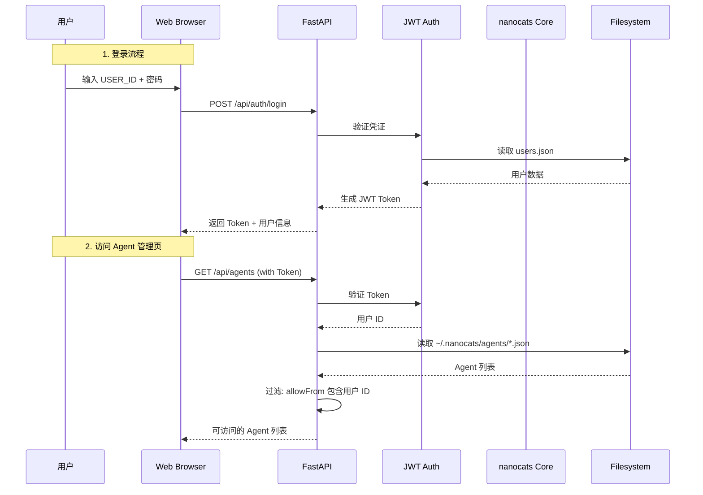
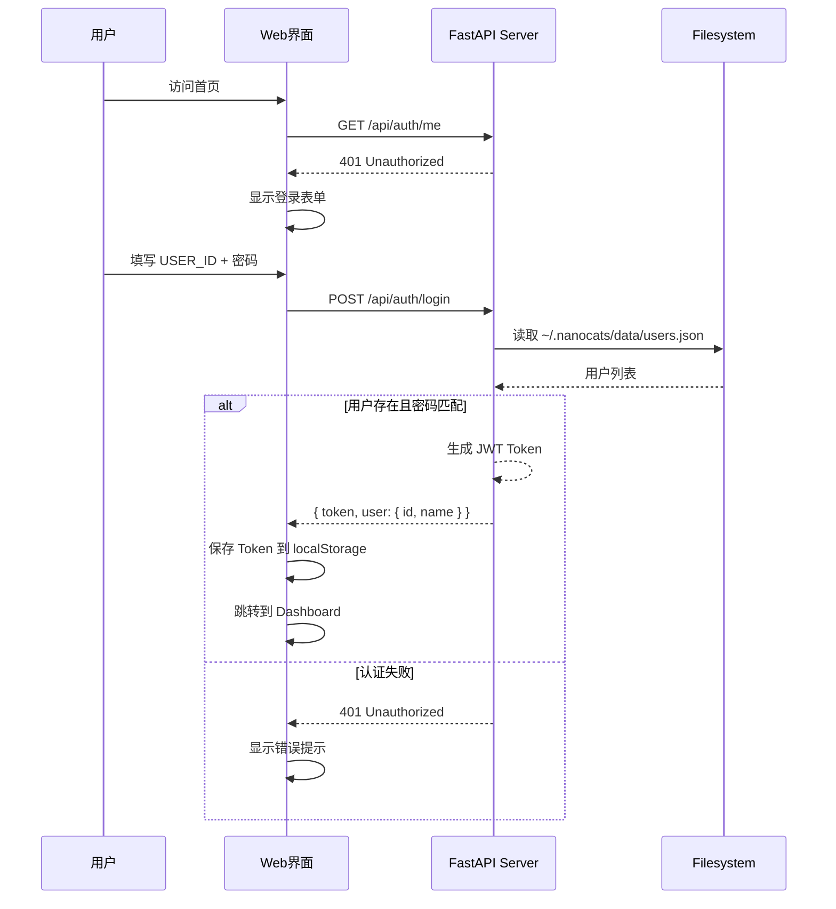
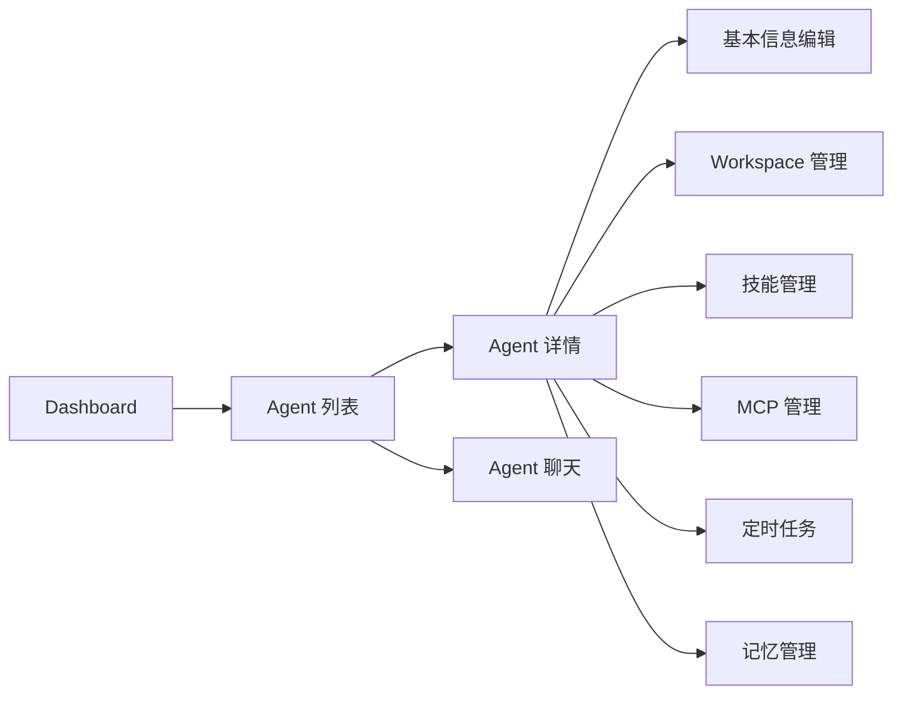
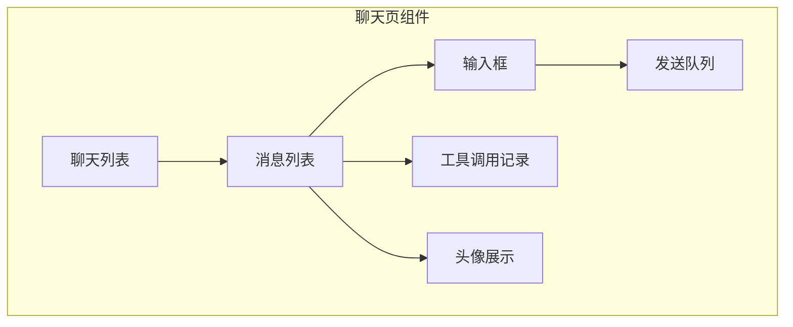
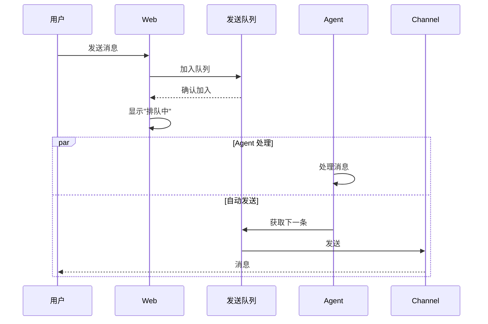

# WebUI 功能设计方案

> 基于现有 nanocats web channel 扩展的管理界面设计方案
> 版本: 1.2
> 日期: 2026-03-15

---

## 目录

1. [设计目标与背景](#1-设计目标与背景)
2. [系统架构](#2-系统架构)
3. [用户登录鉴权](#3-用户登录鉴权)
4. [Agent 管理页](#4-agent-管理页)
5. [Agent 聊天页](#5-agent-聊天页)
6. [模型 Token 使用情况报表页](#6-模型-token-使用情况报表页)
7. [日志查看](#7-日志查看)
8. [数据模型设计](#8-数据模型设计)
9. [API 设计](#9-api-设计)
10. [安全性考虑](#10-安全性考虑)
11. [技术选型](#11-技术选型)
12. [实施计划](#12-实施计划)

---

## 1. 设计目标与背景

### 1.1 现有 Web Channel 分析

当前 `nanocats/channels/web.py` 实现了基础的 WebSocket 聊天功能:

- 基于 FastAPI + WebSocket
- 通过第一个消息传递 `user_id` 建立会话
- 使用 `allowFrom` 配置进行访问控制
- 消息通过 MessageBus 进行路由

### 1.2 扩展目标

在现有 Web Channel 基础上扩展为完整的 WebUI 管理界面:

| 功能模块 | 描述 |
|---------|------|
| **登录鉴权** | 用户名(USER_ID) + 密码认证 |
| **Agent 管理** | 配置管理、workspace 管理、技能/MCP/定时任务/记忆管理 |
| **聊天界面** | 对话记录、发送队列、手动触发、头像展示 |
| **Token 报表** | 按天/模型维度的 token 消耗统计 |
| **日志查看** | 多维度日志查询与过滤 |

### 1.3 设计原则

- **渐进式增强**: 基于现有 web channel 扩展
- **权限最小化**: Agent 访问权限基于 `allowFrom` 配置
- **数据本地化**: 所有数据存储在本地文件系统
- **无状态 API**: 使用 JWT Token 进行认证

---

## 2. 系统架构

### 2.1 整体架构图

```mermaid
graph TB
    subgraph "客户端"
        WEB[Web Browser<br/>React SPA]
    end

    subgraph "nanocats WebUI 服务"
        API[FastAPI Backend<br/>REST API]
        WS[WebSocket Handler<br/>聊天实时通信]
        AUTH[JWT Authentication<br/>登录鉴权]
    end

    subgraph "nanocats Core"
        BUS[MessageBus<br/>消息队列]
        AGENT[AgentLoop<br/>Agent 核心]
        PROVIDER[LLM Provider<br/>模型调用]
        REGISTRY[AgentRegistry<br/>Agent 配置管理]
    end

    subgraph "数据存储"
        CONFIG[~/.nanocats/config.json<br/>主配置]
        AGENTS[~/.nanocats/agents/*.json<br/>Agent 配置]
        WORKSPACE[~/.nanocats/workspace<br/>工作空间]
        SESSION[~/.nanocats/workspaces/{agent_id}/sessions<br/>会话历史]
        TOKEN_DB[~/.nanocats/data/token_usage.jsonl<br/>Token 使用记录]
        LOGS[~/.nanocats/logs<br/>日志文件]
        USERS[~/.nanocats/data/users.json<br/>用户认证信息]
    end

    WEB --> API
    WEB --> WS
    API --> AUTH
    API --> REGISTRY
    API --> CONFIG
    API --> AGENTS
    API --> WORKSPACE
    API --> TOKEN_DB
    API --> LOGS
    WS --> BUS
    BUS --> AGENT
    AGENT --> PROVIDER
    REGISTRY --> AGENTS
```

### 2.2 请求流程图



---

## 3. 用户登录鉴权

### 3.1 用户认证流程



### 3.2 用户数据结构

**存储位置**: `~/.nanocats/data/users.json`

```json
{
  "users": [
    {
      "user_id": "user123",
      "password_hash": "$2b$12$...", 
      "name": "张三",
      "role": "user",
      "created_at": "2026-01-01T00:00:00Z",
      "last_login": "2026-03-15T10:00:00Z"
    }
  ]
}
```

**字段说明**:

| 字段 | 类型 | 描述 |
|------|------|------|
| user_id | string | 用户ID，用于 Agent 的 allowFrom 匹配 |
| password_hash | string | bcrypt 加密的密码哈希 |
| name | string | 显示名称 |
| role | string | 角色: admin / user |
| created_at | string | 创建时间 ISO8601 |
| last_login | string | 最后登录时间 ISO8601 |

### 3.3 登录 API

**POST /api/auth/login**

Request:
```json
{
  "user_id": "user123",
  "password": "password123"
}
```

Response (成功):
```json
{
  "token": "eyJhbGciOiJIUzI1NiIs...",
  "user": {
    "user_id": "user123",
    "name": "张三",
    "role": "user"
  }
}
```

Response (失败):
```json
{
  "detail": "Invalid credentials"
}
```

### 3.4 JWT Token 格式

```json
{
  "sub": "user123",
  "name": "张三",
  "role": "user",
  "exp": 1710499200,
  "iat": 1710403200
}
```

**配置**:
- 密钥: 读取 `~/.nanocats/config.json` 中的 `web.jwt_secret`，无则自动生成
- 过期时间: 7 天 (可配置)

---

## 4. Agent 管理页

### 4.1 Agent 列表页

#### 4.1.1 页面结构



#### 4.1.2 权限过滤逻辑

```python
def filter_accessible_agents(agents: list[AgentConfig], user_id: str, user_role: str) -> list[AgentConfig]:
    """过滤用户可访问的 Agent"""
    accessible = []
    
    for agent in agents:
        # Admin 角色可以访问所有 Agent
        if user_role == "admin":
            accessible.append(agent)
            continue
            
        # 检查 channel 配置中的 allowFrom
        for channel_name, channel_cfg in agent.channels.configs.items():
            if not channel_cfg.enabled:
                continue
            if user_id in channel_cfg.allow_from or "*" in channel_cfg.allow_from:
                accessible.append(agent)
                break
    
    return accessible
```

#### 4.1.3 Agent 列表 API

**GET /api/agents**

Response:
```json
{
  "agents": [
    {
      "id": "admin",
      "name": "Admin Agent",
      "type": "admin",
      "model": "anthropic/claude-opus-4-5",
      "provider": "anthropic",
      "workspace": "~/.nanocats/workspace",
      "accessible_channels": ["telegram", "web"],
      "allow_from": ["user123", "user456"]
    },
    {
      "id": "myagent",
      "name": "My Agent",
      "type": "user",
      "model": "openai/gpt-4",
      "provider": "openai",
      "workspace": "~/.nanocats/workspaces/myagent",
      "accessible_channels": ["telegram"],
      "allow_from": ["user123"]
    }
  ]
}
```

### 4.2 Agent 基本信息编辑

#### 4.2.1 可编辑字段

| 字段 | 类型 | 描述 |
|------|------|------|
| name | string | Agent 显示名称 |
| model | string | 模型名称 (如 anthropic/claude-opus-4-5) |
| provider | string | 模型供应商 |
| auto_start | boolean | 是否自动启动 |

#### 4.2.2 API

**GET /api/agents/{agent_id}**

Response:
```json
{
  "id": "myagent",
  "name": "My Agent",
  "type": "user",
  "model": "openai/gpt-4",
  "provider": "openai",
  "auto_start": true,
  "channels": {
    "configs": {
      "telegram": {
        "enabled": true,
        "allowFrom": ["user123"]
      },
      "web": {
        "enabled": true,
        "allowFrom": ["user123"]
      }
    }
  }
}
```

**PATCH /api/agents/{agent_id}**

Request:
```json
{
  "name": "New Agent Name",
  "model": "anthropic/claude-sonnet-4-20250514",
  "provider": "anthropic"
}
```

### 4.3 渠道管理

#### 4.3.1 功能说明

渠道管理用于控制 Agent 在各个聊天平台的可访问性。每个 Agent 可以独立配置是否在某个渠道启用。

**配置格式说明**:

| 配置位置 | 格式 | 用途 |
|----------|------|------|
| 主配置 (`~/.nanocats/config.json`) | 简化格式 (`channels.enabled: ["web"]`) | **仅用于 gateway 启动时决定启用哪些通道** |
| Agent 配置 (`~/.nanocats/agents/{id}.json`) | 详细格式 (`channels.configs.web.enabled + allowFrom`) | **管理 Agent 渠道权限** |

**配置分离原则**:
- 主配置的简化格式仅在 `nanocats gateway` 启动时起作用
- Agent 的详细配置用于消息路由时的权限验证
- WebUI 页面只管理 Agent 渠道配置（详细格式）

**现有渠道列表** (从 Agent 配置中获取):
- telegram
- discord
- feishu (飞书)
- slack
- whatsapp
- dingtalk (钉钉)
- qq
- email
- web
- matrix
- wecom (企业微信)
- mochat

#### 4.3.2 权限说明

| 字段 | 作用 |
|------|------|
| enabled | 渠道有效性开关 |
| allowFrom | 可访问的用户 ID 列表 (`*` 表示所有用户) |

**重要**: `allowFrom` 字段由 **Agent 配置** 管理，不在 WebUI 渠道管理页面中修改。

**配置示例** (`~/.nanocats/agents/myagent.json`):
```json
{
  "channels": {
    "configs": {
      "web": {
        "enabled": true,
        "allowFrom": ["user123", "user456"]
      }
    }
  }
}
```

#### 4.3.3 API

**GET /api/agents/{agent_id}/channels**

Response:
```json
{
  "channels": [
    {
      "name": "telegram",
      "enabled": true,
      "display_name": "Telegram"
    },
    {
      "name": "web",
      "enabled": true,
      "display_name": "Web UI"
    },
    {
      "name": "discord",
      "enabled": false,
      "display_name": "Discord"
    }
  ]
}
```

**PATCH /api/agents/{agent_id}/channels/{channel_name}**

Request:
```json
{
  "enabled": false
}
```

Response:
```json
{
  "name": "discord",
  "enabled": false,
  "display_name": "Discord"
}
```

### 4.4 Workspace 管理

#### 4.4.1 Workspace 文件结构

每个 Agent 的 workspace 包含以下文件:

```
~/.nanocats/workspaces/{agent_id}/
├── SOUL.md          # Agent 身份与性格
├── TOOLS.md         # 工具使用说明
├── USER.md          # 用户信息
├── AGENTS.md        # Agent 指令
├── HEARTBEAT.md     # 周期性任务
├── skills/          # 技能目录
│   ├── skill1/
│   │   └── SKILL.md
│   └── skill2/
├── memory/          # 记忆目录
│   ├── MEMORY.md    # 长期记忆
│   └── HISTORY.md   # 历史记录
├── cron/            # 定时任务配置
│   └── jobs.json
└── sessions/        # 会话历史
    ├── global.jsonl
    └── user_default.jsonl
```

**全局 workspace** (仅 admin 可访问):
```
~/.nanocats/workspace/          # 全局共享 workspace
├── SOUL.md
├── TOOLS.md
├── USER.md
├── AGENTS.md
├── HEARTBEAT.md
├── skills/
├── memory/
└── cron/
```

#### 4.3.2 Workspace 文件编辑 API

**GET /api/agents/{agent_id}/workspace/{file}**

支持文件: `SOUL.md`, `TOOLS.md`, `USER.md`, `AGENTS.md`, `HEARTBEAT.md`

Response:
```json
{
  "file": "SOUL.md",
  "content": "# Soul\n\nI am nanocats...",
  "last_modified": "2026-03-15T10:00:00Z"
}
```

**PUT /api/agents/{agent_id}/workspace/{file}**

Request:
```json
{
  "content": "# Soul\n\nI am updated nanocats..."
}
```

### 4.5 Skill 管理

#### 4.4.1 Skill 列表

**GET /api/agents/{agent_id}/skills**

内置 Skill (只读):
```json
{
  "builtin": [
    {
      "name": "github",
      "description": "GitHub 操作技能",
      "path": "nanocats/skills/github"
    },
    {
      "name": "cron",
      "description": "定时任务管理",
      "path": "nanocats/skills/cron"
    }
  ],
  "workspace": [
    {
      "name": "custom_skill",
      "description": "自定义技能",
      "path": "~/.nanocats/workspaces/myagent/skills/custom_skill",
      "enabled": true
    }
  ]
}
```

#### 4.4.2 Skill CRUD

**POST /api/agents/{agent_id}/skills**

Request:
```json
{
  "name": "my_custom_skill",
  "description": "我的自定义技能",
  "content": "# My Custom Skill\n\n## 概述\n..."
}
```

**DELETE /api/agents/{agent_id}/skills/{skill_name}**

### 4.6 MCP 管理

#### 4.5.1 MCP 配置结构

**GET /api/agents/{agent_id}/mcp**

Response:
```json
{
  "servers": {
    "filesystem": {
      "type": "stdio",
      "command": "npx",
      "args": ["-y", "@modelcontextprotocol/server-filesystem", "/path"],
      "enabled": true
    }
  }
}
```

#### 4.5.2 MCP CRUD

**POST /api/agents/{agent_id}/mcp**

Request:
```json
{
  "name": "new_server",
  "type": "stdio",
  "command": "npx",
  "args": ["-y", "@modelcontextprotocol/server-filesystem", "/tmp"],
  "enabled": true
}
```

**DELETE /api/agents/{agent_id}/mcp/{server_name}**

### 4.7 Cron 管理

#### 4.6.1 Cron 任务结构

```json
{
  "jobs": [
    {
      "id": "job_001",
      "name": "每日提醒",
      "enabled": true,
      "schedule": {
        "kind": "cron",
        "expr": "0 9 * * *",
        "tz": "Asia/Shanghai"
      },
      "payload": {
        "kind": "system_event",
        "message": "每日站会提醒",
        "deliver": true,
        "channel": "telegram",
        "to": "user123"
      }
    }
  ]
}
```

#### 4.6.2 Cron API

**GET /api/agents/{agent_id}/cron**

**POST /api/agents/{agent_id}/cron**

**PUT /api/agents/{agent_id}/cron/{job_id}**

**DELETE /api/agents/{agent_id}/cron/{job_id}**

### 4.8 Memory 管理

#### 4.7.1 Memory 文件

- `memory/MEMORY.md` - 长期事实记忆
- `memory/HISTORY.md` - 时间序日志

#### 4.7.2 Memory API

**GET /api/agents/{agent_id}/memory**

Response:
```json
{
  "memory": {
    "content": "# Memory\n\n用户偏好: ...",
    "last_modified": "2026-03-15T10:00:00Z"
  },
  "history": {
    "content": "2026-03-15: 整合了会话...\n",
    "last_modified": "2026-03-15T10:00:00Z"
  }
}
```

**PUT /api/agents/{agent_id}/memory**

Request:
```json
{
  "content": "# Memory\n\n用户偏好: 喜欢简洁的回答"
}
```

### 4.9 Admin 全局 Workspace 特殊权限

#### 4.8.1 权限说明

| Agent 类型 | 可管理 Workspace |
|------------|-----------------|
| admin | 自己 + 全局 (~/.nanocats/workspace) |
| user | 仅自己 |
| specialized | 仅自己 |

#### 4.8.2 全局 Workspace 访问

**GET /api/workspace/global**

仅 admin 角色可用，返回全局 workspace 路径

---

## 5. Agent 聊天页

### 5.1 页面结构



### 5.2 对话记录

#### 5.2.1 会话存储位置

```
~/.nanocats/workspaces/{agent_id}/sessions/
├── global.jsonl          # Admin agent
├── user_default.jsonl    # User agent 默认会话
├── user_work.jsonl       # User agent 分组会话
├── agent_myagent.jsonl   # Specialized agent
└── task_xxx.jsonl       # Task agent
```

**路径说明**: 每个 Agent 的会话存储在各自独立的 workspace 目录下。

#### 5.2.2 会话文件格式 (JSONL)

```jsonl
{"_type": "metadata", "key": "user:work", "created_at": "2026-01-01T00:00:00", ...}
{"role": "user", "content": "Hello", "timestamp": "2026-03-15T10:00:00Z", "channel": "telegram"}
{"role": "assistant", "content": "Hi!", "timestamp": "2026-03-15T10:00:01Z", "channel": "telegram"}
{"role": "tool", "tool_call_id": "call_abc", "name": "read_file", "content": "file content..."}
```

#### 5.2.3 筛选功能

**API: GET /api/agents/{agent_id}/messages**

Query Parameters:
| 参数 | 类型 | 描述 |
|------|------|------|
| channel | string | 筛选通道 (telegram, discord, web) |
| chat_id | string | 筛选会话 ID |
| session_key | string | 筛选会话 key |
| limit | int | 返回数量 (默认 50) |
| before | string | 时间戳，用于分页 |

Response:
```json
{
  "messages": [
    {
      "id": "msg_001",
      "role": "user",
      "content": "Hello",
      "timestamp": "2026-03-15T10:00:00Z",
      "channel": "telegram",
      "chat_id": "123456789"
    },
    {
      "id": "msg_002",
      "role": "assistant",
      "content": "Hi! How can I help?",
      "timestamp": "2026-03-15T10:00:01Z",
      "channel": "telegram",
      "chat_id": "123456789",
      "tool_calls": [
        {
          "id": "call_001",
          "name": "read_file",
          "arguments": {"path": "/tmp/test.md"}
        }
      ]
    }
  ],
  "pagination": {
    "has_more": true,
    "next_before": "2026-03-15T09:55:00Z"
  }
}
```

### 5.3 发送队列

#### 5.3.1 队列机制

Agent 处理完成后自动发送队列中的内容:



#### 5.3.2 队列 API

**POST /api/agents/{agent_id}/queue**

Request:
```json
{
  "content": "要发送的消息",
  "channel": "telegram",
  "chat_id": "123456789"
}
```

**GET /api/agents/{agent_id}/queue**

Response:
```json
{
  "queue": [
    {
      "id": "q_001",
      "content": "消息内容",
      "channel": "telegram",
      "chat_id": "123456789",
      "status": "pending",
      "created_at": "2026-03-15T10:00:00Z"
    }
  ]
}
```

**DELETE /api/agents/{agent_id}/queue/{queue_id}**

### 5.4 手动触发指令

支持以下指令:

| 指令 | 描述 |
|------|------|
| /new | 开始新会话 |
| /stop | 停止当前处理 |
| /restart | 重启 Agent |
| /help | 显示帮助 |

**实现方式**: 通过 WebSocket 发送特殊消息

```javascript
ws.send(JSON.stringify({
  type: 'command',
  command: '/new',
  channel: 'telegram',
  chat_id: '123456789'
}));
```

### 5.5 工具调用记录

#### 5.5.1 显示格式

```json
{
  "tool_calls": [
    {
      "id": "call_001",
      "name": "read_file",
      "arguments": {
        "path": "~/project/README.md"
      },
      "result": "file content...",
      "duration_ms": 150,
      "status": "success"
    },
    {
      "id": "call_002", 
      "name": "exec",
      "arguments": {
        "command": "ls -la"
      },
      "result": "total 12...",
      "duration_ms": 50,
      "status": "success"
    }
  ]
}
```

### 5.6 头像解析

#### 5.6.1 Agent 头像 - 从 SOUL.md 解析

```markdown
# Soul

I am nanocats 🐈, a personal AI assistant.

## Avatar


```

**解析规则**:
1. 查找 SOUL.md 中的 `## Avatar` 章节
2. 提取其中的图片 URL
3. 无则使用默认头像

#### 5.6.2 用户头像 - 从 USER.md 解析

```markdown
# User Profile

## Basic Information

- **Name**: 张三
- **Avatar**: 
```

**解析规则**:
1. 查找 USER.md 中的 `## Basic Information` 或 `## Avatar` 章节
2. 提取其中的图片 URL
3. 无则使用首字母生成头像

---

## 6. 模型 Token 使用情况报表页

### 6.1 数据收集

#### 6.1.1 Token 使用记录

在每次 LLM 调用后记录:

```python
# 位置: nanocats/providers/base.py
async def chat(self, ...):
    response = await self._call_api(...)
    
    # 记录使用量
    token_record = {
        "timestamp": datetime.now().isoformat(),
        "agent_id": self.agent_id,
        "model": model,
        "provider": provider_name,
        "input_tokens": response.usage.get("prompt_tokens", 0),
        "output_tokens": response.usage.get("completion_tokens", 0),
        "total_tokens": response.usage.get("total_tokens", 0),
        "cache_hit": response.usage.get("cache_hit_tokens", 0),
        "session_key": session_key
    }
    
    # 写入文件
    write_token_record(token_record)
```

**存储位置**: `~/.nanocats/data/token_usage.jsonl`

```jsonl
{"timestamp": "2026-03-15T10:00:00Z", "agent_id": "admin", "model": "claude-opus-4-5", "provider": "anthropic", "input_tokens": 1000, "output_tokens": 500, "total_tokens": 1500, "cache_hit": 0, "session_key": "global"}
{"timestamp": "2026-03-15T10:05:00Z", "agent_id": "myagent", "model": "gpt-4", "provider": "openai", "input_tokens": 2000, "output_tokens": 800, "total_tokens": 2800, "cache_hit": 500, "session_key": "user:default"}
```

### 6.2 报表 API

#### 6.2.1 按天维度统计

**GET /api/analytics/tokens**

Query Parameters:
| 参数 | 类型 | 描述 |
|------|------|------|
| start_date | string | 开始日期 (2026-03-01) |
| end_date | string | 结束日期 (2026-03-15) |
| agent_id | string | 筛选 Agent |
| model | string | 筛选模型 |

Response:
```json
{
  "summary": {
    "total_input_tokens": 1500000,
    "total_output_tokens": 800000,
    "total_tokens": 2300000,
    "total_cache_hit": 200000
  },
  "by_date": [
    {
      "date": "2026-03-15",
      "input_tokens": 500000,
      "output_tokens": 300000,
      "total_tokens": 800000,
      "cache_hit": 50000
    }
  ],
  "by_model": [
    {
      "model": "claude-opus-4-5",
      "provider": "anthropic",
      "input_tokens": 800000,
      "output_tokens": 400000,
      "total_tokens": 1200000,
      "cache_hit": 100000
    }
  ],
  "by_agent": [
    {
      "agent_id": "admin",
      "total_tokens": 500000,
      "percentage": 21.7
    }
  ]
}
```

#### 6.2.2 图表数据

**GET /api/analytics/tokens/chart**

Response:
```json
{
  "daily_trend": [
    {"date": "2026-03-01", "tokens": 50000},
    {"date": "2026-03-02", "tokens": 75000},
    {"date": "2026-03-03", "tokens": 60000}
  ],
  "model_distribution": [
    {"model": "claude-opus-4-5", "value": 1200000},
    {"model": "gpt-4", "value": 800000},
    {"model": "gpt-3.5-turbo", "value": 300000}
  ]
}
```

---

## 7. 日志查看

### 7.1 日志收集

#### 7.1.1 日志分类

| 类型 | 文件 | 描述 |
|------|------|------|
| agent | `~/.nanocats/logs/agent_{agent_id}.log` | Agent 运行日志 |
| channel | `~/.nanocats/logs/channel_{channel}.log` | 通道日志 |
| tool | `~/.nanocats/logs/tools.log` | 工具调用日志 |
| mcp | `~/.nanocats/logs/mcp.log` | MCP 日志 |
| system | `~/.nanocats/logs/nanocats.log` | 系统日志 |

#### 7.1.2 日志格式

```
2026-03-15 10:00:00.123 [INFO] [agent:admin] [session:global] User: Hello
2026-03-15 10:00:00.456 [DEBUG] [agent:admin] [session:global] Tool call: read_file(path="README.md")
2026-03-15 10:00:01.234 [INFO] [agent:admin] [session:global] Tool result: 150 chars
2026-03-15 10:00:02.345 [INFO] [provider:anthropic] [model:claude-opus-4-5] Tokens: input=1000, output=500
```

### 7.2 日志 API

#### 7.2.1 查询日志

**GET /api/logs**

Query Parameters:
| 参数 | 类型 | 描述 |
|------|------|------|
| type | string | 日志类型 (agent/channel/tool/mcp/system) |
| agent_id | string | Agent ID |
| channel | string | 通道 |
| level | string | 日志级别 (DEBUG/INFO/WARNING/ERROR) |
| keyword | string | 关键词搜索 |
| start_time | string | 开始时间 |
| end_time | string | 结束时间 |
| limit | int | 返回数量 (默认 100) |

Response:
```json
{
  "logs": [
    {
      "timestamp": "2026-03-15T10:00:00.123Z",
      "level": "INFO",
      "type": "agent",
      "agent_id": "admin",
      "session_key": "global",
      "channel": "telegram",
      "message": "User: Hello",
      "metadata": {}
    },
    {
      "timestamp": "2026-03-15T10:00:00.456Z",
      "level": "DEBUG",
      "type": "tool",
      "agent_id": "admin",
      "tool_name": "read_file",
      "message": "Tool call: read_file(path=\"README.md\")",
      "metadata": {
        "duration_ms": 50
      }
    }
  ],
  "pagination": {
    "has_more": true,
    "next_offset": 100
  }
}
```

#### 7.2.2 日志级别说明

| 级别 | 颜色 | 用途 |
|------|------|------|
| DEBUG | 灰色 | 详细调试信息 |
| INFO | 蓝色 | 正常业务流程 |
| WARNING | 黄色 | 警告信息 |
| ERROR | 红色 | 错误信息 |

---

## 8. 数据模型设计

### 8.1 用户模型

```python
class User(BaseModel):
    user_id: str
    password_hash: str
    name: str
    role: str  # "admin" | "user"
    created_at: datetime
    last_login: datetime | None
```

### 8.2 Agent 访问控制模型

```python
class AgentAccess(BaseModel):
    """用户对 Agent 的访问权限"""
    user_id: str
    agent_id: str
    can_read: bool
    can_write: bool
    can_manage_workspace: bool
```

### 8.3 Token 使用记录模型

```python
class TokenUsage(BaseModel):
    timestamp: datetime
    agent_id: str
    model: str
    provider: str
    input_tokens: int
    output_tokens: int
    total_tokens: int
    cache_hit_tokens: int
    session_key: str
```

### 8.4 消息模型

```python
class ChatMessage(BaseModel):
    id: str
    role: str  # "user" | "assistant" | "system" | "tool"
    content: str
    timestamp: datetime
    channel: str
    chat_id: str
    session_key: str
    tool_calls: list[ToolCall] | None = None
```

---

## 9. API 设计

### 9.1 API 路由结构

```
/api
├── /auth
│   ├── POST /login
│   ├── POST /logout
│   ├── GET /me
│   └── POST /users (admin only)
├── /agents
│   ├── GET /                    # 列出可访问的 Agent
│   ├── GET /{agent_id}           # Agent 详情
│   ├── PATCH /{agent_id}         # 更新 Agent 配置
│   ├── GET /{agent_id}/channels              # 渠道列表
│   ├── PATCH /{agent_id}/channels/{name}    # 更新渠道配置
│   ├── GET /{agent_id}/workspace/{file}
│   ├── PUT /{agent_id}/workspace/{file}
│   ├── GET /{agent_id}/skills
│   ├── POST /{agent_id}/skills
│   ├── DELETE /{agent_id}/skills/{name}
│   ├── GET /{agent_id}/mcp
│   ├── POST /{agent_id}/mcp
│   ├── DELETE /{agent_id}/mcp/{name}
│   ├── GET /{agent_id}/cron
│   ├── POST /{agent_id}/cron
│   ├── PUT /{agent_id}/cron/{job_id}
│   ├── DELETE /{agent_id}/cron/{job_id}
│   ├── GET /{agent_id}/memory
│   ├── PUT /{agent_id}/memory
│   ├── GET /{agent_id}/messages
│   ├── GET /{agent_id}/queue
│   ├── POST /{agent_id}/queue
│   └── DELETE /{agent_id}/queue/{queue_id}
├── /workspace
│   └── GET /global (admin only)
├── /analytics
│   ├── GET /tokens
│   └── GET /tokens/chart
└── /logs
    └── GET /
```

### 9.2 认证中间件

```python
async def verify_token(request: Request) -> User:
    """验证 JWT Token 并返回用户信息"""
    auth_header = request.headers.get("Authorization")
    if not auth_header or not auth_header.startswith("Bearer "):
        raise HTTPException(status_code=401, detail="Missing token")
    
    token = auth_header[7:]
    try:
        payload = jwt.decode(token, SECRET_KEY, algorithms=["HS256"])
        user = await get_user(payload["sub"])
        if not user:
            raise HTTPException(status_code=401, detail="User not found")
        return user
    except jwt.ExpiredSignatureError:
        raise HTTPException(status_code=401, detail="Token expired")
    except jwt.InvalidTokenError:
        raise HTTPException(status_code=401, detail="Invalid token")
```

### 9.3 权限检查装饰器

```python
def require_agent_access(action: str = "read"):
    """检查用户是否有权限访问 Agent"""
    def decorator(func):
        @wraps(func)
        async def wrapper(agent_id: str, user: User, ...):
            agent = get_agent(agent_id)
            if not agent:
                raise HTTPException(status_code=404, detail="Agent not found")
            
            # 检查权限
            if not check_agent_access(user, agent, action):
                raise HTTPException(status_code=403, detail="Access denied")
            
            return await func(agent_id, user, ...)
        return wrapper
    return decorator
```

---

## 10. 安全性考虑

### 10.1 认证安全

- 密码使用 bcrypt 加密存储
- JWT Token 设置过期时间
- HTTPS 强制 (生产环境)

### 10.2 访问控制

- Agent 访问基于 `allowFrom` 配置
- Admin 可访问全局 workspace
- 防止路径遍历攻击 (workspace 目录隔离)

### 10.3 文件操作安全

```python
def safe_read_file(path: Path, workspace: Path) -> str:
    """安全读取文件，防止路径遍历"""
    resolved = path.resolve()
    workspace_resolved = workspace.resolve()
    
    if not resolved.is_relative_to(workspace_resolved):
        raise ValueError("Path outside workspace")
    
    return resolved.read_text()
```

### 10.4 API 安全

- Rate limiting: 60 请求/分钟
- CORS 配置
- 请求体大小限制

---

## 11. 技术选型

### 11.1 后端

| 技术 | 用途 | 理由 |
|------|------|------|
| FastAPI | Web 框架 | 现有 web channel 使用，可复用 |
| Pydantic | 数据验证 | 与现有配置系统一致 |
| python-jose | JWT | 轻量级 JWT 实现 |
| passlib | 密码加密 | bcrypt 支持 |
| loguru | 日志 | 现有项目使用 |

### 11.2 前端 (可选 React)

| 技术 | 用途 |
|------|------|
| React 18 | UI 框架 |
| Ant Design | 组件库 |
| React Query | 数据获取 |
| Zustand | 状态管理 |

### 11.3 存储

- **配置**: JSON 文件 (现有)
- **会话**: JSONL 文件 (现有)
- **Token 统计**: JSONL 文件 (新增)
- **用户**: JSON 文件 (新增)
- **日志**: 日志文件 (现有)

---

## 12. 实施计划

### 12.1 Phase 1: 基础架构

1. [ ] 扩展 FastAPI 应用，添加 REST API
2. [ ] 实现用户认证系统 (users.json + JWT)
3. [ ] 添加 Agent 列表与详情 API
4. [ ] 实现权限过滤逻辑
5. [ ] **迁移现有 Agent 配置**: 将简化格式 `channels.enabled: ["web"]` 转换为详细格式 `channels.configs.web.enabled + allowFrom`

### 12.2 Phase 2: Agent 管理

1. [ ] Workspace 文件 CRUD API
2. [ ] Skill 管理 API
3. [ ] MCP 管理 API
4. [ ] Cron 管理 API
5. [ ] Memory 管理 API

### 12.3 Phase 3: 聊天功能

1. [ ] 消息历史 API
2. [ ] WebSocket 实时聊天增强
3. [ ] 发送队列功能
4. [ ] 头像解析逻辑

### 12.4 Phase 4: 统计与日志

1. [ ] Token 使用记录收集
2. [ ] Token 报表 API
3. [ ] 日志查询 API
4. [ ] 前端页面开发

---

## 附录

### A. 配置文件示例

**~/.nanocats/config.json 扩展**:
```json
{
  "channels": {
    "web": {
      "enabled": true,
      "host": "0.0.0.0",
      "port": 15751,
      "allowFrom": ["*"],
      "ui": {
        "enabled": true,
        "port": 15852
      }
    }
  },
  "web": {
    "jwt_secret": "your-secret-key",
    "jwt_expire_hours": 168,
    "session_timeout_minutes": 30
  }
}
```

### B. Agent 配置文件格式

**Agent 配置必须使用详细格式**:

```json
{
  "id": "myagent",
  "name": "My Agent",
  "type": "admin",
  "sessionPolicy": "global",
  "model": "MiniMax-M2.5",
  "provider": "minimax",
  "autoStart": true,
  "channels": {
    "configs": {
      "web": {
        "enabled": true,
        "allowFrom": ["user123"]
      },
      "telegram": {
        "enabled": true,
        "allowFrom": ["123456789"]
      }
    }
  }
}
```

**字段说明**:

| 字段 | 类型 | 描述 |
|------|------|------|
| channels.configs | object | 渠道配置字典 |
| channels.configs.{channel}.enabled | boolean | 是否启用该渠道 |
| channels.configs.{channel}.allowFrom | array | 允许访问的用户 ID 列表 (`*` 表示所有用户) |

**注意**: `channels.enabled: ["web"]` 简化格式仅适用于**主配置** (`~/.nanocats/config.json`)，不适用于 Agent 配置。

---

### C. 主配置文件示例

**~/.nanocats/config.json**:
```json
{
  "channels": {
    "web": {
      "enabled": true,
      "host": "0.0.0.0",
      "port": 15751
    }
  }
}
```

---

*文档版本: 1.1*
*最后更新: 2026-03-15*
