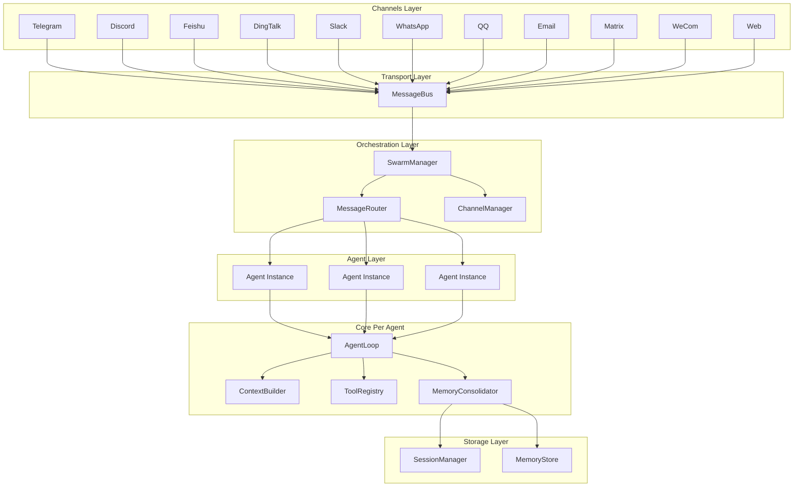
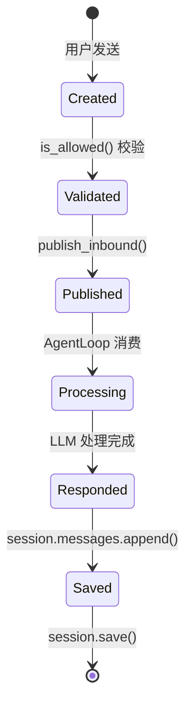
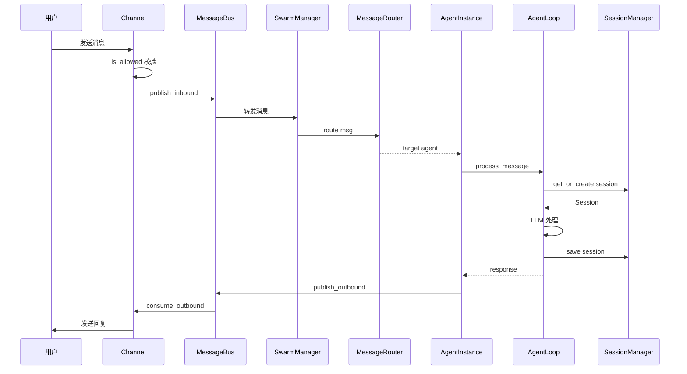
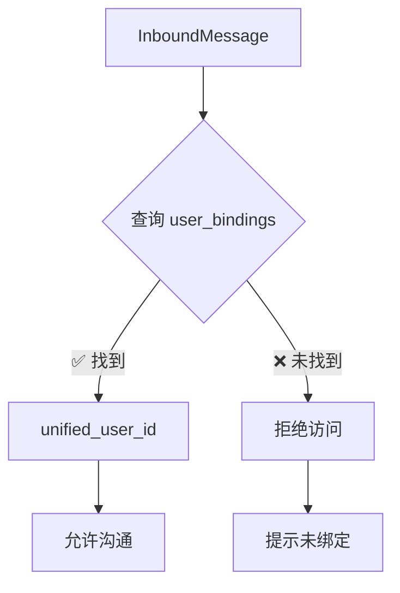
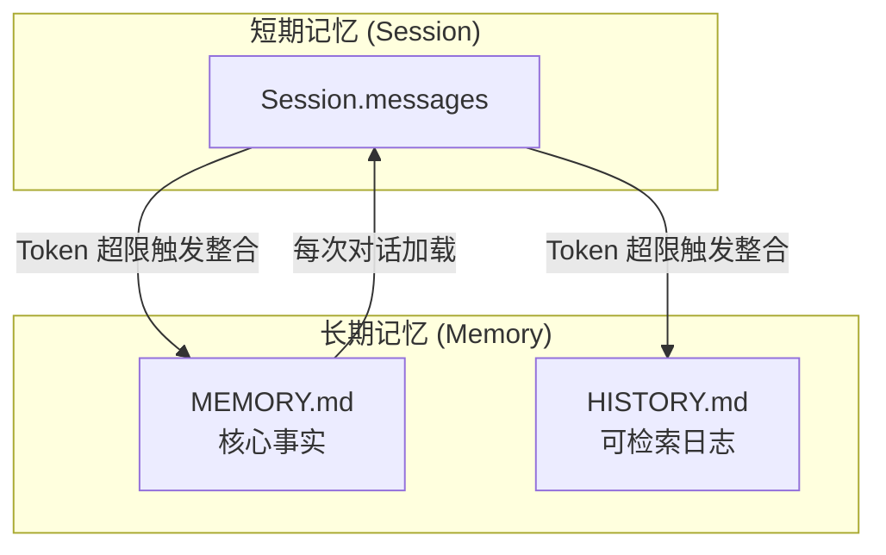
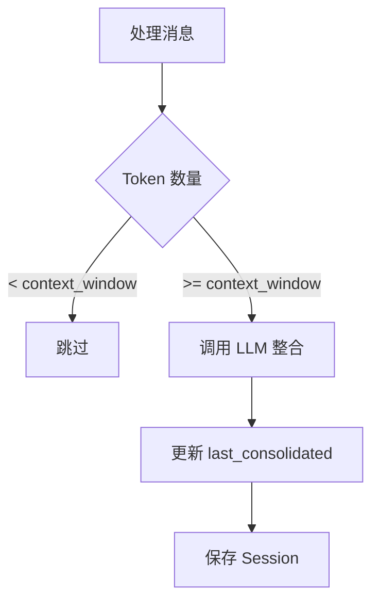
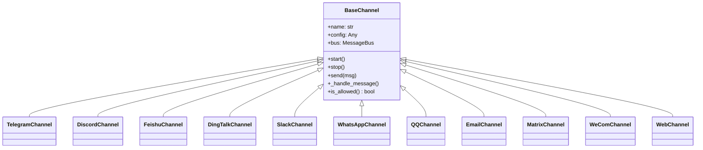
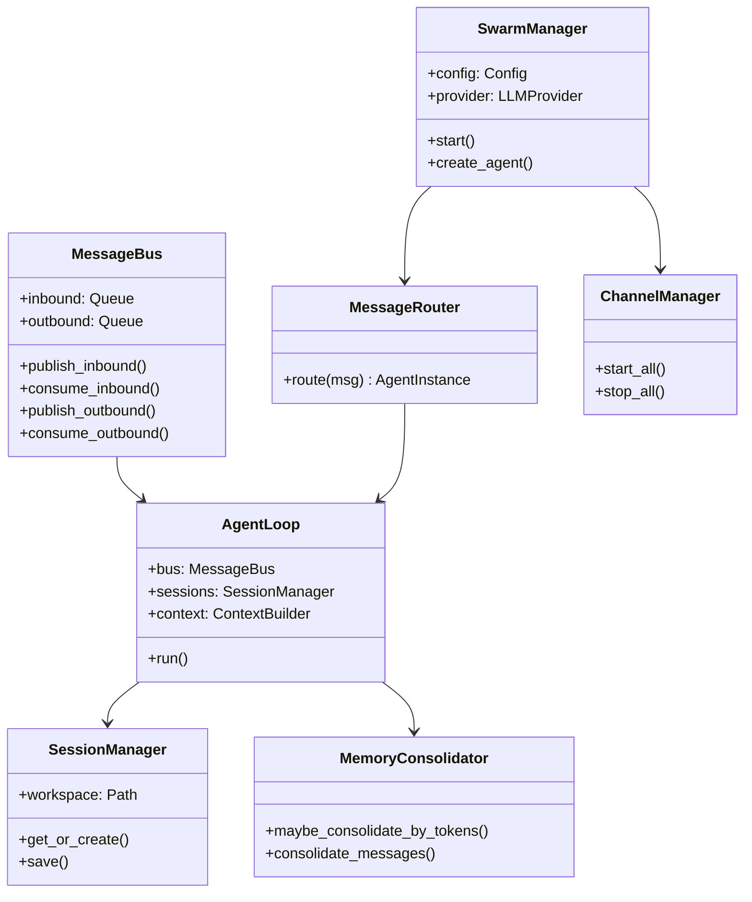
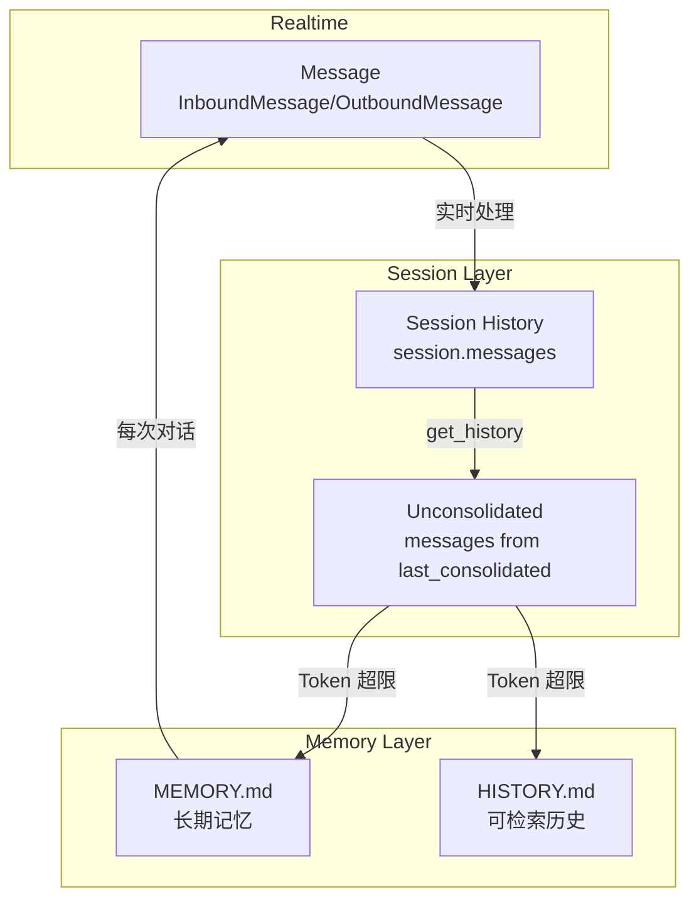

# nanocats 架构设计文档

> 版本: v1.0

---

## 1. 设计原则

### 1.1 核心设计理念

nanocat 采用 **Swarm 统一架构**，所有运行模式（单 Agent、Swarm、Web）均通过 SwarmManager 统一管理。

**核心理念**：
- **统一入口**：所有模式共用同一套启动流程
- **消息驱动**：基于 MessageBus 的异步消息队列
- **Channel 抽象**：所有通信渠道继承 BaseChannel 统一接口
- **数据分层**：消息 → Session → Memory 三层数据管理

### 1.2 架构分层



---

## 2. Workspace 设计

### 2.1 设计目标

- **隔离性**：每个 Agent 拥有独立工作空间，数据、生命周期互不影响
- **分层设计**：全局模板空间 + Agent 独立空间

### 2.2 目录结构

```
~/.nanocat/
├── templates/              # 全局模板空间
│   ├── AGENTS.md
│   ├── TOOLS.md
│   ├── HEARTBEAT.md
│   ├── SOUL.md
│   ├── USER.md
│   ├── BOOTSTRAP.md
│   └── skills/             # 全局共享 skills
│
└── workspaces/             # Agent 工作空间目录
    ├── {agent_id_1}/       # Agent 1 的独立空间
    │   ├── memory/          # 记忆存储
    │   │   ├── MEMORY.md   # 长期事实记忆
    │   │   └── history/    # 可检索历史日志
    │   ├── skills/         # Agent 专属 skills
    │   └── sessions/        # 会话历史
    │
    ├── {agent_id_2}/       # Agent 2 的独立空间
    │   ├── memory/
    │   ├── skills/
    │   └── sessions/
    │
    └── {agent_id_n}/       # Agent n 的独立空间
        ├── memory/
        ├── skills/
        └── sessions/
```

### 2.3 路径规范

| 空间类型 | 路径 | 用途 |
|---------|------|------|
| 全局模板 | `~/.nanocats/templates` | 全局模板文件和共享 skills |
| Agent 工作空间 | `~/.nanocats/workspaces/{agent_id}` | Agent 专属数据 |

---

## 3. Agent 类型与 Workspace

### 3.1 Agent 类型定义

| Agent 类型 | Workspace | 说明 |
|-----------|----------|------|
| **Supervisor** | 有 | 全局管理者，可访问全局 templates |
| **User** | 有 | 普通用户 Agent，独立工作空间 |
| **Specialized** | 有 | 专业 Agent，独立工作空间 |
| **Task** | 无 | 临时性 Agent，无持久化 workspace |

### 3.2 Skill 安装权限

| Agent 类型 | 全局安装 | 本地安装 |
|-----------|----------|----------|
| **Supervisor** | ✅ | ✅ |
| **User** | ❌ | ✅ |
| **Specialized** | ❌ | ✅ |
| **Task** | ❌ | ❌ |

**安装路径规则**：
- 全局安装（仅 Supervisor）：`~/.nanocats/templates/skills/`
- 本地安装（所有非 Task Agent）：`~/.nanocats/workspaces/{agent_id}/skills/`

---

## 4. 消息流转设计

### 4.1 消息类型定义

#### InboundMessage（入站消息）

```python
@dataclass
class InboundMessage:
    channel: str           # telegram, discord, web, etc.
    sender_id: str         # 用户标识
    chat_id: str           # 聊天/群组标识
    content: str           # 消息内容
    timestamp: datetime    # 时间戳
    media: list[str]       # 媒体文件路径
    metadata: dict         # 扩展元数据
    session_key_override: str | None  # 可选的 session key 覆盖
```

#### OutboundMessage（出站消息）

```python
@dataclass
class OutboundMessage:
    channel: str           # 目标 channel
    chat_id: str           # 目标聊天
    content: str           # 回复内容
    reply_to: str | None   # 引用消息 ID
    media: list[str]       # 媒体附件
    metadata: dict         # 扩展元数据
```

### 4.2 消息生命周期



### 4.3 完整消息流转



---

## 5. Session 管理

### 5.1 Session 数据结构

```python
@dataclass
class Session:
    key: str                     # "channel:chat_id"
    messages: list[dict]         # 消息历史（append-only）
    created_at: datetime
    updated_at: datetime
    metadata: dict
    last_consolidated: int = 0   # 已整合到 memory 的消息数
```

### 5.2 Session 隔离策略

| Agent 类型 | Session 隔离维度 | Session Key 格式 |
|-----------|-----------------|------------------|
| **Supervisor** | 全局融合 | `global` |
| **User** | 用户隔离 | `user:{unified_user_id}` |
| **Specialized** | Agent 隔离 | `agent:{caller_agent_id}` |
| **Task** | 任务隔离 | `task:{task_id}` |

### 5.3 统一用户标识

通过 **User Binding** 机制实现跨渠道用户识别：

```json
{
  "users": {
    "zhangsan": {
      "name": "张三",
      "channels": {
        "telegram": "123456789",
        "feishu": "ou_abc123",
        "web": "zhangsan"
      }
    }
  }
}
```

**识别流程**：


---

## 6. Memory 管理

### 6.1 双层记忆架构



### 6.2 MEMORY.md 设计

> 目的：存储核心事实、用户偏好、重要决策

```markdown
# Long-term Memory

> Last updated: 2026-03-14
> Agent: user_agent

## User Profile
- 姓名: 张三
- 偏好语言: 中文
- 沟通风格: 喜欢简洁直接的回复

## Key Facts
- 项目: nanocats
- 技术栈: Python, FastAPI, React

## Important Decisions
- [2026-03-10] 决定采用 Swarm 统一架构
```

### 6.3 HISTORY.md 设计

> 目的：可检索的历史日志，按天归档

```
workspaces/{agent_id}/memory/
├── MEMORY.md              # 核心事实
└── history/               # 按天归档
    ├── 2026-03-14.md
    ├── 2026-03-13.md
    └── 2026-03-12.md
```

### 6.4 整合触发条件



---

## 7. Channel 架构

### 7.1 BaseChannel 抽象

所有 Channel 继承统一抽象基类：



### 7.2 支持的 Channel 清单

| Channel | 协议 | 状态 |
|---------|------|------|
| Telegram | Bot API Long Polling | ✅ |
| Discord | Discord Bot WebSocket | ✅ |
| Feishu | 飞书 Bot HTTP Webhook | ✅ |
| DingTalk | 钉钉 Bot HTTP Callback | ✅ |
| Slack | Slack Socket Mode | ✅ |
| WhatsApp | WhatsApp Cloud API | ✅ |
| QQ | NapCat WebSocket | ✅ |
| Email | IMAP/SMTP | ✅ |
| Matrix | Matrix Client-Server API | ✅ |
| WeCom | 企业微信 Callback | ✅ |
| Web | WebSocket | ✅ |

---

## 8. 核心组件关系

### 8.1 类关系图



### 8.2 数据流关系



---

## 9. 总结

### 9.1 架构优势

| 优势 | 说明 |
|------|------|
| **统一入口** | 所有模式共用 SwarmManager，降低维护成本 |
| **异步解耦** | MessageBus 实现组件间松耦合 |
| **扩展性** | 新 Channel 只需继承 BaseChannel |
| **跨渠道融合** | User Binding 实现统一用户视图 |
| **智能记忆** | Token 触发自动整合，减轻上下文压力 |

### 9.2 核心文件索引

| 文件 | 职责 |
|------|------|
| `nanocats/bus/events.py` | 消息数据结构定义 |
| `nanocats/bus/queue.py` | MessageBus 实现 |
| `nanocats/channels/base.py` | BaseChannel 抽象基类 |
| `nanocats/swarm/manager.py` | SwarmManager 核心管理 |
| `nanocats/swarm/router.py` | MessageRouter 消息路由 |
| `nanocats/agent/loop.py` | AgentLoop 核心处理循环 |
| `nanocats/session/manager.py` | SessionManager 会话管理 |
| `nanocats/agent/memory.py` | MemoryStore/MemoryConsolidator |
