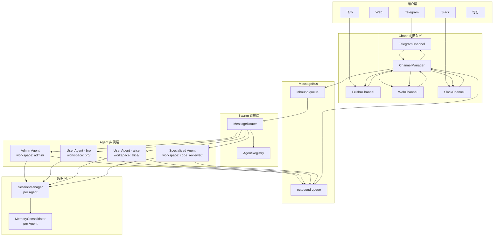
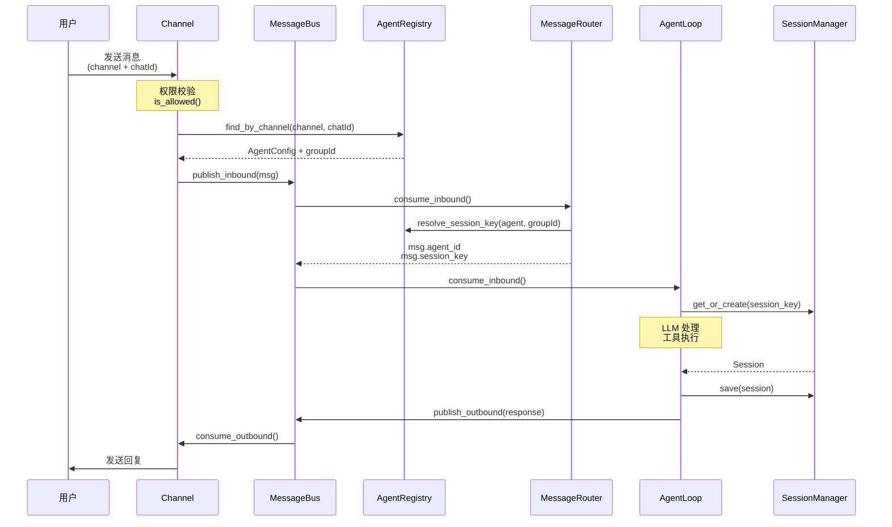
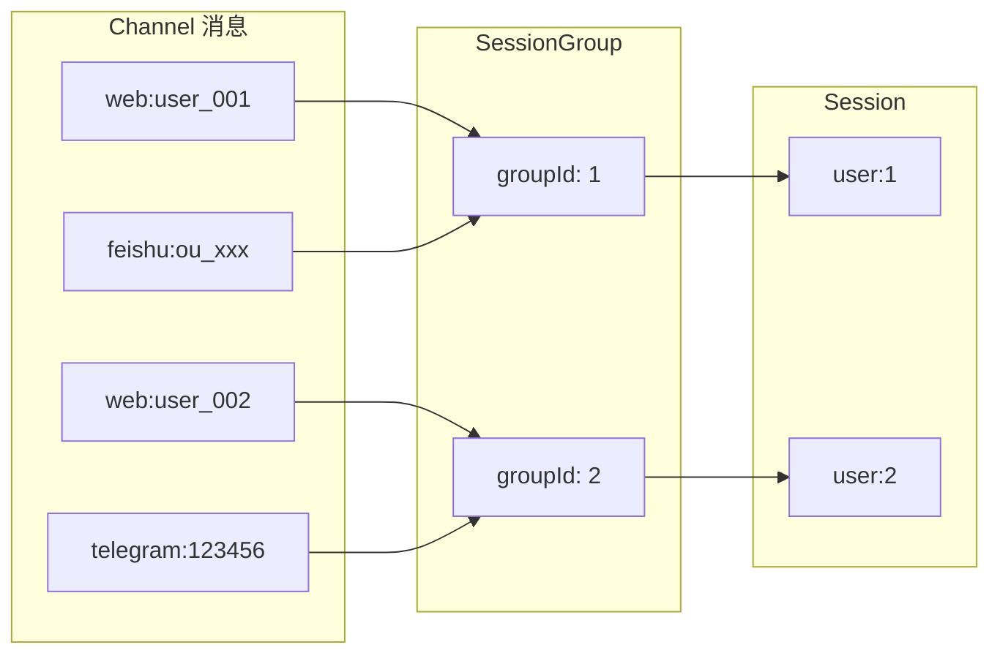

# NanoCats Agent Swarm 架构代码改造方案

> 版本：v2.0
> 日期：2026-03-14
> 状态：**待 Review**

---

## 1. 概述

本文档详细描述将 nanocats 从单 Agent 架构改造为 Agent Swarm 架构的具体代码改动。

**重要变更（v2.0）：**
- 配置目录修正为 `~/.nanocats/`
- AgentConfig 合并到 `config/schema.py`
- 完全移除单 Agent 模式
- Session 消息保留 channel/chat_id 用于展示筛选

---

## 2. 架构设计图

### 2.1 整体架构图



### 2.2 消息流转图



### 2.3 Session 聚合图



---

## 3. 核心改造说明

### 3.1 路径修正

所有配置路径修正为 `~/.nanocats/`：

```
~/.nanocats/
├── agents/                    # Agent 配置目录
│   ├── admin.json
│   ├── bro.json
│   └── code_reviewer.json
│
├── config.json               # 全局配置（仅 providers 等）
│
├── templates/                # 全局模板
│
└── workspaces/               # Agent 工作空间
    ├── admin/
    │   ├── memory/
    │   ├── skills/
    │   └── sessions/
    │       └── global.jsonl
    │
    ├── bro/
    │   ├── memory/
    │   ├── skills/
    │   └── sessions/
    │       ├── user_1.jsonl
    │       └── user_2.jsonl
    │
    └── code_reviewer/
        └── ...
```

### 3.2 AgentConfig 合并到 schema.py

将 AgentConfig 合并到 `config/schema.py`，统一配置管理：

```python
# nanocats/config/schema.py 新增

from enum import Enum
from dataclasses import dataclass, field
from pathlib import Path
from typing import Any

class AgentType(str, Enum):
    ADMIN = "admin"
    USER = "user"
    SPECIALIZED = "specialized"
    TASK = "task"


@dataclass
class ChannelConfig:
    """单个 Channel 配置"""
    enabled: bool = False
    allow_from: list[str] = field(default_factory=list)
    extra: dict[str, Any] = field(default_factory=dict)


@dataclass
class SessionGroupConfig:
    """Session 分组配置"""
    group_id: str
    chat_ids: dict[str, str]  # channel -> chat_id


@dataclass
class AgentChannelsConfig:
    """Agent Channel 配置"""
    configs: dict[str, ChannelConfig] = field(default_factory=dict)
    session_groups: list[SessionGroupConfig] = field(default_factory=list)
    allow_agents: list[str] = field(default_factory=list)


@dataclass
class AgentConfig:
    """Agent 配置"""
    id: str
    name: str
    type: AgentType
    channels: AgentChannelsConfig = field(default_factory=AgentChannelsConfig)
    session_policy: str = "per_user"
    model: str = "anthropic/claude-opus-4-5"
    provider: str = "anthropic"
    ttl: int | None = None
    auto_start: bool = True
    bound_user_key: str | None = None
    token: str | None = None
    routing: dict[str, Any] = field(default_factory=dict)

    @property
    def workspace(self) -> Path:
        return Path.home() / ".nanocats" / "workspaces" / self.id


class AgentsConfig(Base):
    """多 Agent 配置"""
    agents: dict[str, AgentConfig] = field(default_factory=dict)
```

### 3.3 完全移除单 Agent 模式

**改造前：**
```python
# cli/commands.py
agent = AgentLoop(bus=bus, provider=provider, workspace=...)
```

**改造后：**
```python
# cli/commands.py
swarm = SwarmManager(bus=bus, provider=provider)
asyncio.gather(
    swarm.start(),
    channel_manager.start_all(),
)
```

不再有单 Agent 启动选项，所有 Agent 通过 `SwarmManager` 管理。

### 3.4 Session 消息保留 channel/chat_id

Session 中每条消息保留原始 channel 和 chat_id：

```python
# session/manager.py
@dataclass
class Session:
    key: str  # user:1
    
    # 新增：消息来源追踪
    message_sources: dict[str, dict] = field(default_factory=dict)
    
    def add_message(self, role: str, content: str, **kwargs):
        msg = {
            "role": role,
            "content": content,
            "timestamp": datetime.now().isoformat(),
            # 新增：保留原始来源
            "_source": kwargs.pop("_source", {}),
            **kwargs
        }
        # 记录来源映射
        if "_source" in msg:
            source = msg["_source"]
            self.message_sources[source.get("channel", "")] = source
        
        self.messages.append(msg)

# 消息来源结构
class InboundMessage:
    channel: str      # telegram
    chat_id: str      # 123456
    
    # 在保存时记录到消息中
    def to_session_message(self) -> dict:
        return {
            "role": "user",
            "content": self.content,
            "_source": {
                "channel": self.channel,
                "chat_id": self.chat_id,
                "sender_id": self.sender_id,
            }
        }
```

**Session 文件格式：**
```jsonl
{"_type": "metadata", "key": "user:1", "created_at": "..."}
{"role": "user", "content": "hello", "_source": {"channel": "web", "chat_id": "user_001"}}
{"role": "assistant", "content": "hi"}
{"role": "user", "content": "hi", "_source": {"channel": "feishu", "chat_id": "ou_xxx"}}
```

### 3.5 Channel 改造影响

**结论：Channel 层改造最小化，仅需传递 AgentRegistry**

Channel 实现无需感知 Agent 逻辑改动：

```python
# channels/base.py (最小改动)
class BaseChannel(ABC):
    def __init__(
        self,
        config: Any,
        bus: MessageBus,
        agent_registry: "AgentRegistry | None" = None,  # 新增参数
    ):
        self.config = config
        self.bus = bus
        self.agent_registry = agent_registry  # 可选，无缝兼容
        self._running = False
    
    async def _handle_message(self, sender_id, chat_id, content, ...):
        # 原有逻辑不变
        msg = InboundMessage.from_channel(...)
        
        # 新增：如果有 registry，解析 Agent
        if self.agent_registry:
            await self._resolve_agent_info(msg)
        
        await self.bus.publish_inbound(msg)
```

**Channel 无感要点：**
1. Channel 的 `start()`, `stop()`, `send()` 方法无需改动
2. 权限校验 `is_allowed()` 保持不变
3. `_handle_message()` 仅增加可选的 Agent 解析
4. 出站消息路由由 ChannelManager 统一处理

---

## 4. 核心类型定义

### 4.1 Agent 类型定义

> **注意**：以下类型定义位于 `nanocats/config/schema.py`，而非单独的 `agent/types.py`。

```python
# nanocats/config/schema.py
from enum import Enum
from dataclasses import dataclass, field
from pathlib import Path
from typing import Any

from pydantic import BaseModel, Field


class AgentType(str, Enum):
    """Agent 类型枚举"""
    ADMIN = "admin"
    USER = "user"
    SPECIALIZED = "specialized"
    TASK = "task"


class ChannelConfig(Base):
    """单个 Channel 的配置"""
    enabled: bool = False
    allow_from: list[str] = Field(default_factory=list)
    extra: dict[str, Any] = Field(default_factory=dict)


class SessionGroup(Base):
    """Session 分组配置"""
    group_id: str
    chat_ids: dict[str, str]  # channel -> chat_id


class AgentChannelsConfig(Base):
    """Agent 的 Channel 配置"""
    configs: dict[str, ChannelConfig] = Field(default_factory=dict)
    session_groups: list[SessionGroup] = Field(default_factory=list)
    allow_agents: list[str] = Field(default_factory=list)


class AgentConfig(Base):
    """Agent 配置数据类"""
    
    model_config = {"extra": "allow"}
    
    id: str
    name: str
    type: AgentType = AgentType.USER
    
    # Channel 配置
    channels: AgentChannelsConfig = Field(default_factory=AgentChannelsConfig)
    
    # Session 策略
    session_policy: str = "per_user"
    
    # 模型配置
    model: str = "anthropic/claude-opus-4-5"
    provider: str = "anthropic"
    
    # 生命周期
    ttl: int | None = None
    auto_start: bool = True
    
    # 认证
    bound_user_key: str | None = None
    token: str | None = None
    
    # 路由
    routing: dict[str, Any] = Field(default_factory=dict)
    
    @property
    def workspace(self) -> Path:
        """Agent 的独立工作空间路径"""
        return Path.home() / ".nanocats" / "workspaces" / self.id
```

---

## 5. Agent 配置加载

### 5.1 AgentConfigLoader

```python
# nanocats/agent/config.py
import json
from pathlib import Path
from loguru import logger
from nanocats.config.schema import AgentConfig, AgentType, AgentChannelsConfig, ChannelConfig, SessionGroup


class AgentConfigLoader:
    """Agent 配置加载器"""
    
    AGENTS_DIR = Path.home() / ".nanocats" / "agents"
    
    @classmethod
    def get_agents_dir(cls) -> Path:
        cls.AGENTS_DIR.mkdir(parents=True, exist_ok=True)
        return cls.AGENTS_DIR
    
    @classmethod
    def load(cls, agent_id: str) -> AgentConfig | None:
        config_path = cls.get_agents_dir() / f"{agent_id}.json"
        if not config_path.exists():
            return None
        
        with open(config_path, encoding="utf-8") as f:
            data = json.load(f)
        
        return cls._parse(agent_id, data)
    
    @classmethod
    def load_all(cls) -> dict[str, AgentConfig]:
        agents = {}
        for path in cls.get_agents_dir().glob("*.json"):
            agent_id = path.stem
            if config := cls.load(agent_id):
                agents[agent_id] = config
        return agents
    
    @classmethod
    def _parse(cls, agent_id: str, data: dict) -> AgentConfig:
        # 解析 channels
        channels_data = data.get("channels", {})
        configs = {}
        for name, ch_data in channels_data.get("configs", {}).items():
            standard_fields = {"enabled", "allowFrom"}
            extra = {k: v for k, v in ch_data.items() if k not in standard_fields}
            configs[name] = ChannelConfig(
                enabled=ch_data.get("enabled", False),
                allow_from=ch_data.get("allowFrom", []),
                extra=extra,
            )
        
        session_groups = [
            SessionGroup(group_id=sg["groupId"], chat_ids=sg["chatIds"])
            for sg in channels_data.get("sessionGroups", [])
        ]
        
        channels = AgentChannelsConfig(
            configs=configs,
            session_groups=session_groups,
            allow_agents=channels_data.get("allowAgents", []),
        )
        
        return AgentConfig(
            id=agent_id,
            name=data.get("name", agent_id),
            type=AgentType(data.get("type", "user")),
            channels=channels,
            session_policy=data.get("sessionPolicy", "per_user"),
            model=data.get("model", "anthropic/claude-opus-4-5"),
            provider=data.get("provider", "anthropic"),
            ttl=data.get("ttl"),
            auto_start=data.get("autoStart", True),
            bound_user_key=data.get("boundUserKey"),
            token=data.get("token"),
            routing=data.get("routing", {}),
        )
```

---

## 6. Agent 注册表

### 6.1 AgentRegistry

```python
# nanocats/agent/registry.py
from nanocats.agent.config import AgentConfigLoader
from nanocats.config.schema import AgentConfig, AgentType, ChannelConfig


class AgentRegistry:
    """Agent 注册表"""
    
    def __init__(self):
        self._agents: dict[str, AgentConfig] = {}
        self._load()
    
    def _load(self):
        self._agents = AgentConfigLoader.load_all()
    
    def reload(self):
        self._load()
    
    def get(self, agent_id: str) -> AgentConfig | None:
        return self._agents.get(agent_id)
    
    def get_all(self) -> dict[str, AgentConfig]:
        return self._agents.copy()
    
    def get_auto_start_agents(self) -> list[AgentConfig]:
        return [a for a in self._agents.values() if a.auto_start]
    
    def find_by_channel(self, channel: str, chat_id: str) -> tuple[AgentConfig, str | None] | None:
        """根据 Channel + ChatId 查找 Agent"""
        for agent in self._agents.values():
            channel_cfg = agent.channels.configs.get(channel)
            if not channel_cfg or not channel_cfg.enabled:
                continue
            
            # 检查 allowFrom
            if not self._is_chat_allowed(channel_cfg, chat_id):
                continue
            
            # 查找 session group
            group_id = self._find_session_group(agent, channel, chat_id)
            return agent, group_id
        
        return None
    
    def _is_chat_allowed(self, channel_cfg: ChannelConfig, chat_id: str) -> bool:
        allow_list = channel_cfg.allow_from
        if not allow_list:
            return False
        if "*" in allow_list:
            return True
        return chat_id in allow_list
    
    def _find_session_group(self, agent: AgentConfig, channel: str, chat_id: str) -> str | None:
        for sg in agent.channels.session_groups:
            if channel in sg.chat_ids and sg.chat_ids[channel] == chat_id:
                return sg.group_id
        return None
    
    def resolve_session_key(self, agent: AgentConfig, group_id: str | None = None) -> str:
        """解析 Session Key"""
        if agent.type == AgentType.ADMIN:
            return "global"
        elif agent.type == AgentType.USER:
            return f"user:{group_id or 'default'}"
        elif agent.type == AgentType.SPECIALIZED:
            return f"agent:{agent.id}"
        elif agent.type == AgentType.TASK:
            return f"task:{agent.id}"
        raise ValueError(f"Unknown agent type: {agent.type}")
    
    def can_communicate(self, from_agent_id: str, to_agent_id: str) -> bool:
        from_agent = self.get(from_agent_id)
        to_agent = self.get(to_agent_id)
        if not from_agent or not to_agent:
            return False
        return to_agent_id in from_agent.channels.allow_agents
```

---

## 7. Session 管理改造

### 7.1 Session 消息来源追踪

```python
# nanocats/session/manager.py
import json
from dataclasses import dataclass, field
from datetime import datetime
from pathlib import Path
from typing import Any

from nanocats.utils.helpers import ensure_dir, safe_filename


@dataclass
class Session:
    """会话数据类"""
    key: str  # user:1 / global / agent:xxx / task:xxx
    
    # 消息来源追踪
    message_sources: dict[str, dict] = field(default_factory=dict)
    
    messages: list[dict[str, Any]] = field(default_factory=list)
    created_at: datetime = field(default_factory=datetime.now)
    updated_at: datetime = field(default_factory=datetime.now)
    metadata: dict[str, Any] = field(default_factory=dict)
    last_consolidated: int = 0
    
    def add_message(self, role: str, content: str, **kwargs: Any) -> None:
        msg = {
            "role": role,
            "content": content,
            "timestamp": datetime.now().isoformat(),
            **kwargs
        }
        
        # 记录来源映射
        if "_source" in msg and msg["_source"]:
            source = msg["_source"]
            channel = source.get("channel", "")
            if channel:
                self.message_sources[channel] = source
        
        self.messages.append(msg)
        self.updated_at = datetime.now()
    
    def get_history(self, max_messages: int = 500) -> list[dict[str, Any]]:
        # 现有逻辑不变
        ...
    
    def clear(self):
        self.messages = []
        self.message_sources = {}
        self.last_consolidated = 0
        self.updated_at = datetime.now()


class SessionManager:
    """Session 管理器"""
    
    def __init__(self, workspace: Path, agent_id: str | None = None):
        self.workspace = workspace
        self.agent_id = agent_id
        self.sessions_dir = ensure_dir(workspace / "sessions")
        self._cache: dict[str, Session] = {}
    
    @staticmethod
    def parse_session_key(key: str) -> dict:
        parts = key.split(":")
        if parts[0] == "global":
            return {"agent_type": "admin", "key": "global"}
        elif parts[0] == "user":
            return {"agent_type": "user", "key": key}
        elif parts[0] == "agent":
            return {"agent_type": "specialized", "key": key}
        elif parts[0] == "task":
            return {"agent_type": "task", "key": key}
        raise ValueError(f"Invalid session key: {key}")
    
    def get_or_create(self, key: str) -> Session:
        if key in self._cache:
            return self._cache[key]
        session = self._load(key) or Session(key=key)
        self._cache[key] = session
        return session
    
    def _load(self, key: str) -> Session | None:
        path = self._get_session_path(key)
        if not path.exists():
            return None
        # 加载逻辑...
    
    def save(self, session: Session) -> None:
        path = self._get_session_path(session.key)
        with open(path, "w", encoding="utf-8") as f:
            # metadata
            f.write(json.dumps({
                "_type": "metadata",
                "key": session.key,
                "created_at": session.created_at.isoformat(),
                "updated_at": session.updated_at.isoformat(),
                "message_sources": session.message_sources,
            }, ensure_ascii=False) + "\n")
            # messages
            for msg in session.messages:
                f.write(json.dumps(msg, ensure_ascii=False) + "\n")
        self._cache[session.key] = session
    
    def _get_session_path(self, key: str) -> Path:
        safe_key = safe_filename(key.replace(":", "_"))
        return self.sessions_dir / f"{safe_key}.jsonl"
```

---

## 8. 消息事件改造

### 8.1 InboundMessage 扩展

```python
# nanocats/bus/events.py

@dataclass
class InboundMessage:
    """入站消息"""
    
    # 原始来源
    channel: str
    sender_id: str
    chat_id: str
    
    # 内容
    content: str = ""
    media: list[str] = field(default_factory=list)
    timestamp: datetime = field(default_factory=datetime.now)
    metadata: dict[str, Any] = field(default_factory=dict)
    
    # Agent 路由信息
    agent_id: str | None = None
    agent_type: str | None = None
    session_key: str | None = None
    session_group_id: str | None = None
    
    @classmethod
    def from_channel(cls, channel: str, sender_id: str, chat_id: str, **kwargs) -> "InboundMessage":
        return cls(channel=channel, sender_id=sender_id, chat_id=chat_id, **kwargs)
    
    def to_session_message(self) -> dict:
        """转换为 Session 消息格式（保留来源）"""
        return {
            "role": "user",
            "content": self.content,
            "_source": {
                "channel": self.channel,
                "chat_id": self.chat_id,
                "sender_id": self.sender_id,
            }
        }


@dataclass
class OutboundMessage:
    """出站消息"""
    channel: str
    chat_id: str
    content: str
    reply_to: str | None = None
    media: list[str] = field(default_factory=list)
    metadata: dict[str, Any] = field(default_factory=dict)
    agent_id: str | None = None
```

---

## 9. Channel 改造

### 9.1 BaseChannel 最小改动

```python
# nanocats/channels/base.py

class BaseChannel(ABC):
    name: str = "base"
    
    def __init__(self, config: Any, bus: MessageBus, agent_registry: "AgentRegistry | None" = None):
        self.config = config
        self.bus = bus
        self.agent_registry = agent_registry
        self._running = False
    
    async def _handle_message(self, sender_id: str, chat_id: str, content: str, **kwargs):
        if not self.is_allowed(sender_id):
            return
        
        msg = InboundMessage.from_channel(
            channel=self.name,
            sender_id=str(sender_id),
            chat_id=str(chat_id),
            content=content,
            **kwargs
        )
        
        # 可选：解析 Agent 信息
        if self.agent_registry:
            await self._resolve_agent_info(msg)
        
        await self.bus.publish_inbound(msg)
    
    async def _resolve_agent_info(self, msg: InboundMessage):
        result = self.agent_registry.find_by_channel(msg.channel, msg.chat_id)
        if result:
            agent, group_id = result
            session_key = self.agent_registry.resolve_session_key(agent, group_id)
            msg.agent_id = agent.id
            msg.agent_type = agent.type.value
            msg.session_key = session_key
            msg.session_group_id = group_id
    
    @abstractmethod
    async def start(self): ...
    
    @abstractmethod
    async def stop(self): ...
    
    @abstractmethod
    async def send(self, msg: OutboundMessage): ...
```

### 9.2 ChannelManager 改造

```python
# nanocats/channels/manager.py

class ChannelManager:
    def __init__(self, config, bus, agent_registry=None):
        self.config = config
        self.bus = bus
        self.agent_registry = agent_registry
        self.channels: dict[str, BaseChannel] = {}
        self._dispatch_task = None
        self._init_channels()
    
    def _init_channels(self):
        # 发现并创建 Channel（传入 agent_registry）
        for name, cls in discover_all().items():
            section = getattr(self.config.channels, name, {})
            if not section.get("enabled"):
                continue
            try:
                channel = cls(section, self.bus, self.agent_registry)
                self.channels[name] = channel
            except Exception as e:
                logger.warning("{} not available: {}", name, e)
```

---

## 10. AgentLoop 改造

### 10.1 接收 AgentConfig

```python
# nanocats/agent/loop.py

class AgentLoop:
    def __init__(
        self,
        bus: MessageBus,
        agent_config: AgentConfig,  # 改为 AgentConfig
        provider: LLMProvider,
        # ... 其他参数
    ):
        self.bus = bus
        self.agent_config = agent_config
        self.workspace = agent_config.workspace
        self.sessions = SessionManager(self.workspace, agent_id=agent_config.id)
        # ...
    
    async def _process_message(self, msg: InboundMessage) -> OutboundMessage | None:
        # 使用 msg.session_key 或生成新的
        if msg.session_key:
            key = msg.session_key
        else:
            # 根据 Agent 类型生成
            if self.agent_config.type == AgentType.ADMIN:
                key = "global"
            elif self.agent_config.type == AgentType.USER:
                key = f"user:{msg.session_group_id or 'default'}"
            else:
                key = f"agent:{msg.metadata.get('caller_agent_id', self.agent_config.id)}"
        
        session = self.sessions.get_or_create(key)
        
        # 添加消息时保留来源
        session.add_message("user", msg.content, _source={
            "channel": msg.channel,
            "chat_id": msg.chat_id,
            "sender_id": msg.sender_id,
        })
        
        # ... 后续处理
```

---

## 11. Swarm 管理器

### 11.1 SwarmManager

```python
# nanocats/swarm/manager.py
import asyncio
from loguru import logger

from nanocats.agent.registry import AgentRegistry
from nanocats.agent.loop import AgentLoop
from nanocats.config.schema import AgentConfig
from nanocats.bus.queue import MessageBus
from nanocats.providers.base import LLMProvider


class SwarmManager:
    """Swarm 管理器"""
    
    def __init__(self, bus: MessageBus, provider: LLMProvider):
        self.bus = bus
        self.provider = provider
        self.registry = AgentRegistry()
        self.agents: dict[str, AgentLoop] = {}
        self._running = False
    
    async def start(self):
        self._running = True
        
        # 启动所有自动启动的 Agent
        for agent_config in self.registry.get_auto_start_agents():
            await self.start_agent(agent_config)
        
        logger.info("Swarm started with {} agents", len(self.agents))
        
        while self._running:
            await asyncio.sleep(1)
    
    async def start_agent(self, config: AgentConfig):
        if config.id in self.agents:
            return
        
        logger.info("Starting agent: {} ({})", config.id, config.type.value)
        
        agent = AgentLoop(
            bus=self.bus,
            agent_config=config,
            provider=self.provider,
            # ... 其他参数
        )
        
        self.agents[config.id] = agent
        asyncio.create_task(agent.run())
    
    async def stop(self):
        self._running = False
        for agent_id in list(self.agents.keys()):
            agent = self.agents.pop(agent_id)
            agent.stop()
            await agent.close_mcp()
```

---

## 12. Gateway 启动改造

### 12.1 改造后的 gateway 命令

```python
# nanocats/cli/commands.py

@app.command()
def gateway(
    port: int | None = typer.Option(None, "--port", "-p"),
    verbose: bool = typer.Option(False, "--verbose", "-v"),
):
    """Start the nanocats swarm gateway."""
    
    from nanocats.bus.queue import MessageBus
    from nanocats.providers.factory import ProviderFactory
    from nanocats.swarm.manager import SwarmManager
    from nanocats.channels.manager import ChannelManager
    
    config = load_config()
    bus = MessageBus()
    provider = ProviderFactory.create(config)
    
    # 创建 Swarm Manager
    swarm = SwarmManager(bus=bus, provider=provider)
    
    # 创建 Channel Manager（传入 AgentRegistry）
    channel_manager = ChannelManager(config, bus, agent_registry=swarm.registry)
    
    async def run():
        try:
            await asyncio.gather(
                swarm.start(),
                channel_manager.start_all(),
            )
        except KeyboardInterrupt:
            pass
        finally:
            await swarm.stop()
            await channel_manager.stop_all()
    
    asyncio.run(run())
```

---

## 13. 目录结构变更

### 13.1 新增文件

```
nanocats/
├── agent/
│   ├── __init__.py
│   ├── config.py        # [NEW] AgentConfigLoader
│   ├── registry.py      # [NEW] AgentRegistry
│   ├── loop.py          # [MOD] 接收 AgentConfig
│   └── ...
│
├── swarm/
│   ├── __init__.py
│   └── manager.py       # [NEW] SwarmManager
│
├── config/
│   └── schema.py        # [MOD] 新增 AgentConfig, AgentType 等
│
└── channels/
    ├── base.py          # [MOD] agent_registry 参数
    └── manager.py       # [MOD] 传递 agent_registry
```

### 13.2 配置文件

```
~/.nanocats/
├── agents/
│   ├── admin.json
│   ├── bro.json
│   └── code_reviewer.json
│
├── config.json          # 全局配置（providers 等）
│
└── workspaces/
    ├── admin/
    │   ├── memory/
    │   ├── skills/
    │   └── sessions/
    │       └── global.jsonl
    │
    ├── bro/
    │   ├── memory/
    │   ├── skills/
    │   └── sessions/
    │       ├── user_1.jsonl
    │       └── user_2.jsonl
    │
    └── code_reviewer/
        └── ...
```

---

## 14. 总结

### 14.1 改造要点

| 要点 | 说明 |
|------|------|
| 配置目录 | `~/.nanocats/` |
| AgentConfig | 合并到 `config/schema.py` |
| 启动模式 | 仅支持 Swarm 模式 |
| Session 来源 | 消息保留 `channel` + `chat_id` |
| Channel 改造 | 最小化，仅传 `agent_registry` |

### 14.2 Channel 无感设计

- Channel 的核心方法 `start()`, `stop()`, `send()` 无需改动
- `_handle_message()` 增加可选的 Agent 解析
- 权限校验逻辑保持不变

---

*文档版本：v2.0 - 2026-03-14*
